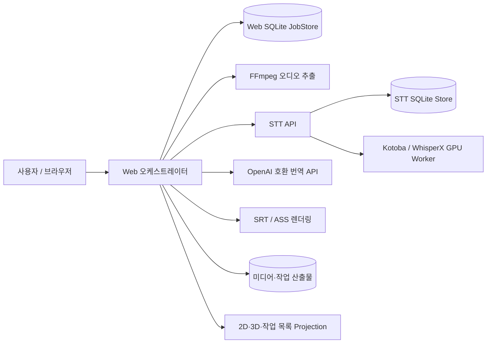
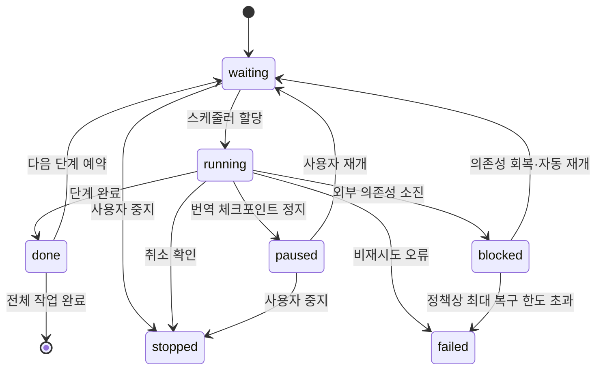
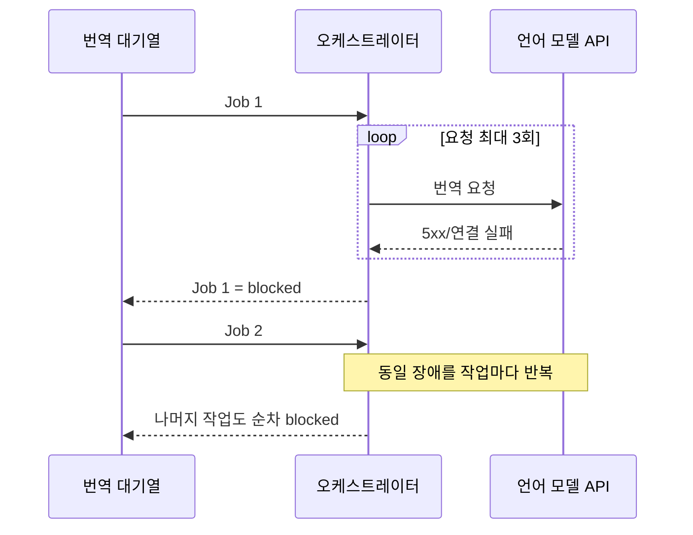
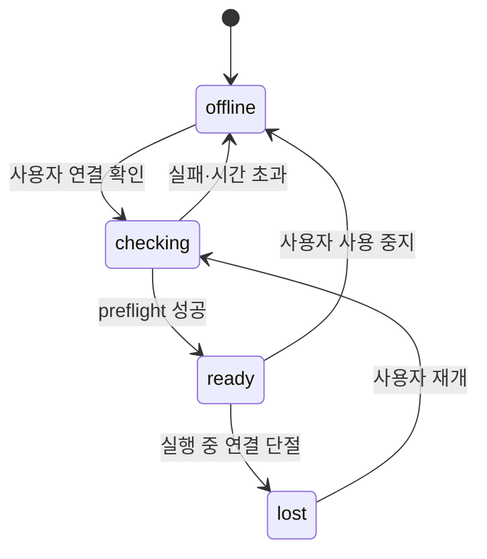
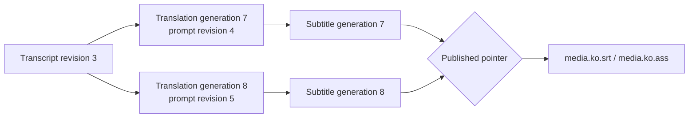

# STT-to-Subtitle 백엔드 리팩터링 분석 보고서

- 작성일: 2026-08-26
- 분석 범위: 웹 오케스트레이터, STT API, 작업 저장소, 외부 서비스 연동, 산출물 처리, 2D/3D 대시보드용 상태 집계
- 기준 버전: 현재 작업 트리의 `4.0.0`

### 구현 진행 상태

현재 작업 트리에는 계획의 스물일곱 번째 수직 슬라이스까지 반영됐다.

| 항목 | 반영 상태 | 남은 범위 |
|---|---|---|
| 작업 상태 계약 | `phase/state/reason_code/attempt` 영속 컬럼과 레거시 마이그레이션, 명시적 `stopped/user_stop`, 2D·3D·목록 공통 상태 집계, 단계+상태 결합 필터, 구조화 전이 이벤트 | 스케줄러의 레거시 `status` 제거·DB 전이 제약 |
| 번역 LLM 수동 gate | 사용자가 시작할 때 `/models` 1회 확인, 연결 실패 시 gate 차단, 번역 중단 작업 수동 재개, dependency state·reason 영속화, 재시작 시 자동 호출 없이 gate 닫기, 명시적 요청의 attempt·결과·소요 시간 계측 | 실환경 장애 복구 검증 |
| 외부 자막 | 같은 stem의 SRT/VTT/ASS 탐지, `외부 자막` 표시, 기본 WebVTT 재생 | 증분 asset/revision catalog·사용자별 재생 선택 |
| 로컬 비교 | 시간 중첩 정렬, coverage·문장 유사도·경계 오차, 파일 해시별 SQLite 결과 | generation/publication FK·검증 알고리즘 version migration |
| 상용 LLM 검증 | 번역 LLM과 분리된 설정, 명시적 1회 호출, 구조화 결과, 입력·모델 cache | provider별 adapter·비용/사용량 관측 |
| 프롬프트 revision | 카테고리 생성·수정·보관·복원, 본문 변경별 immutable revision, 현재/과거 본문 비교, 새 작업·재번역의 과거 revision 선택, 작업 snapshot·translation generation 고정 참조, revision별 번역 결과 비교 | - |
| 번역 generation | generation·batch·segment SQLite 원장, 입력 지문, prompt·transcript revision 참조, 배치 시도·실패, DB 기반 JSON 복구, 재번역·직접 편집 이력, generation attempt fencing, startup generation·batch reconcile, 세그먼트 ID 기반 버전 비교·필터·페이지네이션 | 강제 종료 시점별 실환경 fault test |
| 자막 publication | source별 단일 게시 포인터, generation별 SRT/ASS와 해시, 다운로드·과거 버전 재게시, pair manifest·파일/DB startup reconcile, 최초 게시 4개 교체 지점 fault matrix, 활성 worker lease 보호 | 실제 파일시스템 장애 주입 |
| 원격 STT 취소 | 멱등 cancel API, `cancel_requested/cancelled` 영속 상태, 웹의 취소 호출·최종 확인, WhisperX/JAV process group 종료, Kotoba 청크 경계 취소 | Kotoba diarization/postprocess 즉시 중단·실제 GPU 자원 fault test |
| 시작 복구 | 추출 재대기, 원격 STT 재연결·유실 ID 멱등 재제출, 번역 체크포인트 대기 복원, generation·batch 중단 attempt 확정, 복구 lease 즉시 반환, 검증된 전사·번역 산출물 기반 렌더 재개, 미완료 최초 게시 generation 완결, 게시 자막 pair reconcile, worker lease claim·heartbeat·만료 회수, 단조 증가 fencing token, 제한 시간 graceful drain, SIGKILL 뒤 lease 회수 test, 중지 요청 보존 | 실제 파일시스템·GPU worker fault test |
| 오디오·전사 revision | source·추출 설정 hash 기반 WAV 재사용, immutable WAV·전사 JSON 경로, DB revision 원장·활성 포인터, 직접 편집·비교 선택의 별도 전사 revision, 번역 generation의 transcript revision 참조, 전체 DB 참조 기반 감사·명시적 orphan 정리, 과거 전사 revision 선택·무결성 검증·새 번역 generation 연동 | revision 간 전사 내용 비교가 필요하면 후속 추가 |
| STT 실패 계약 | STT DB·API의 `failure_code/retryable/failure_scope`, segment/schema·OOM·인증·입력·처리·재시작 오류 분류, retryable 실패만 원격 재제출 | 실제 backend별 fault test·오류 코드 운영 지표 |
| STT dispatch gate | 첫 연결 실패 시 영속 gate 차단, 뒤 작업 `audio_ready` 유지, 명시적 연결 확인의 제한된 3회 요청 후 중단 작업 재개 | 자동 recovery mode가 실제로 필요한지 운영 검증·회로 메트릭 |
| 이벤트·관측성 | 구조화 전이 이벤트, 단계 대기·처리 시간, 외부 API attempt별 결과·소요 시간, STT 큐와 원격 실행·취소 수, artifact 감사·정리, startup reconcile, lease fencing 거부, 번역 checkpoint 재사용·무효화를 SQLite에 누적하고 JSON·Prometheus text로 제공하며 민감 label·payload와 고카디널리티 원격 ID label을 거부 | dependency 회로 전이·외부 자막 검증 cache 세부 counter |
| DB 무결성 | 모든 SQLite 연결의 외래키 활성화, 시작 시 레거시 dangling FK/선택 포인터 정리, status-phase-state-reason projection·enum·수치 domain trigger, revision/generation/publication 소유 관계 guard, quick/FK check 운영 지표, 공유 WAV revision의 마지막 참조 기반 삭제 | 순번 기반 migration 모듈 분리·실운영 DB 사본 dry-run |

이하의 문제 분석은 최초 분석 시점 구조를 기준으로 하되, 구현이 끝난 절은 현재
동작과 남은 범위로 갱신했다.

## 1. 결론 요약

현재 코드는 오디오 추출, 원격 전사, 번역, 자막 렌더링이라는 파이프라인 경계를 대체로 지키고 있으며, 번역 체크포인트·전사 요청 멱등성·원자적 JSON 저장·SSE 진행률 수집 등 운영에 필요한 기반도 갖추고 있다.

그러나 작업이 많거나 외부 서비스가 내려간 상황에서 안정적으로 운영하려면 다음 문제를 우선 해결해야 한다.

1. 사용자 표시와 필터는 `phase/state/reason_code/attempt`로 분리됐지만 스케줄러 실행 전이는 아직 레거시 `status`를 호환 필드로 함께 사용한다.
2. 언어 모델 수동 gate와 마지막 상태·사유를 영속화했다. 웹 재시작 시 마지막 `offline/lost`를 복원하고, 이전 상태가 `ready`였어도 자동 호출·dispatch 없이 `offline/manual_start_required`로 시작한다.
3. 웹 프로세스 재시작 시 실행 중 작업을 단계별로 reconcile한다. 원격 STT는 기존 ID에 재연결하고 ID가 유실됐으면 동일 멱등 키로 재제출한다. 번역 LLM은 자동 호출하지 않고 체크포인트를 대기로 복원하며, 실행 중이던 generation·batch attempt는 `interrupted`로 확정한다.
4. 사용자 정지는 신규 작업에서 명시적 `stopped/user_stop`으로 저장한다. 기존 한국어 오류 문구 판별은 과거 DB를 한 번 마이그레이션할 때만 사용한다.
5. 2D 대시보드, 3D 대시보드, 작업 목록은 영속 `state`를 공통 원천으로 사용하고 작업 목록은 `phase + state` 결합 필터를 지원한다.
6. 전사 중지는 원격 STT cancel API를 호출하고 `cancelled` 확인 뒤 웹 작업을 `stopped/user_stop`으로 확정한다. WhisperX/JAV는 process group을 종료하고 Kotoba는 청크 경계에서 협력적으로 중지한다.
7. 번역 결과는 generation·batch·segment 단위로 DB에 저장되고 JSON을 재생성할 수 있다. 실행 작업은 worker lease를 원자적으로 claim하고 heartbeat로 연장하며, 시작 복구는 유효한 다른 소유자의 lease를 건드리지 않고 만료된 작업만 회수한다. 번역 batch·완료 갱신은 현재 활성 generation attempt에서만 허용해 복구 전 worker의 늦은 쓰기를 거부한다.
8. 프롬프트 본문 변경은 immutable prompt revision을 만들고 작업 snapshot과 translation generation이 해당 revision을 고정 참조한다. 프롬프트를 바꾼 재번역과 직접 편집은 별도 translation generation으로 보존하며, SRT/ASS도 generation별 보존·재게시할 수 있다.
9. 미디어 옆의 `<filename>.srt/.vtt/.ass` 외부 자막 탐지·재생·로컬 비교는 추가됐지만 asset/revision/publication 관계와 증분 catalog는 아직 없다.
10. STT 연결 실패는 영속 dispatch gate를 닫아 뒤 작업의 연쇄 실패를 막는다. 자동 background probe는 하지 않으며 사용자가 연결 확인/재개를 실행할 때만 제한된 확인 후 gate를 연다.
11. 외부 요청은 attempt별 성공·재시도·소진·HTTP 오류와 소요 시간을 영속 집계한다. STT readiness 응답의 큐 상태, 웹 작업이 참조하는 원격 실행·취소 대기 ID, 산출물 감사·정리와 시작 복구 결과도 같은 운영 스냅샷에서 확인한다.

가장 먼저 해야 할 일은 UI 확장이 아니라 상태 모델과 스케줄러 제어의 정리다. `phase`, `state`, `reason_code`, `attempt`을 분리하고, 의존성별 수동·자동 복구 정책과 단계별 복구 정책을 추가해야 한다. 반복 번역·자막 재생성을 제품의 기본 사용 방식으로 보고 transcript revision, translation generation, subtitle asset/publication/validation도 영속 도메인으로 관리해야 한다.

### 1.1 확정된 운영 전제

- 번역용 LLM은 고사양 Windows PC에서 실행되며 평소에는 꺼져 있다. LLM offline은 장애가 아니라 정상 운영 상태다.
- LLM에 대한 주기적 `next_probe_at` 호출은 사용하지 않는다. 연결 확인과 번역 재개는 사용자가 명시적으로 시작한다.
- 미디어 `<filename>.*`에 대응하는 `<filename>.srt`, `<filename>.vtt`, `<filename>.ass`는 모두 한국어 `외부 자막`이다.
- 외부 자막은 비교 기준이면서 영상 재생에 사용하는 기본 자막이다. 시스템 생성 자막과 별도 자산으로 보존한다.
- 시스템은 내부망 전용이며 웹 로그인·사용자별 권한 같은 별도 애플리케이션 인증은 요구하지 않는다.
- 상용 LLM을 이용한 자막 검증은 선택 기능이며 자동 실행하지 않는다.

## 2. 현재 구조



주요 책임은 다음 파일에 집중되어 있다.

| 영역 | 주요 구현 | 평가 |
|---|---|---|
| 웹 요청·화면·집계 | [`web_app.py`](../src/stt_to_subtitle/web_app.py) | 4천 줄 이상의 모놀리스로 라우트와 화면별 상태 재분류가 혼재 |
| 파이프라인 실행 | [`orchestrator.py`](../src/stt_to_subtitle/orchestrator.py) | 단계 실행, 스케줄링, 정지, 복구, 이벤트 기록이 한 클래스에 집중 |
| 웹 작업 저장 | [`job_store.py`](../src/stt_to_subtitle/job_store.py) | SQLite 기반 영속화는 적절하나 상태·마이그레이션 계약이 약함 |
| 외부 API | [`service_clients.py`](../src/stt_to_subtitle/service_clients.py) | 요청 재시도와 SSE 재연결을 지원하나 장애 종류 분류와 회로 차단이 없음 |
| STT 서비스 | [`stt_api.py`](../src/stt_to_subtitle/stt_api.py), [`transcription_store.py`](../src/stt_to_subtitle/transcription_store.py) | 전사 요청 멱등성·독립 큐·취소·구조화 실패 코드를 제공. backend별 재시도 가능성 세분화는 남음 |
| 산출물 | [`audio.py`](../src/stt_to_subtitle/audio.py), [`subtitle.py`](../src/stt_to_subtitle/subtitle.py), [`files.py`](../src/stt_to_subtitle/files.py) | JSON은 원자 저장. WAV 및 SRT/ASS 묶음의 장애 복구 보장은 보강 필요 |

현재 SQLite와 단일 웹 스케줄러는 현 규모에서 유지할 수 있다. 상태 모델을 정리하기 전에 메시지 브로커나 분산 데이터베이스를 도입하면 복잡도만 늘어난다.

## 3. 핵심 도메인 모델 평가

### 3.1 현재 문제

`PipelineJob.status`는 다음 정보를 동시에 표현한다.

- 파이프라인 위치: `extracting`, `transcription_running`, `translation_running`
- 실행 상태: `queued`, `blocked`, `failed`
- 단계 완료 사실: `audio_ready`, `transcribed`, `translation_completed`
- 사용자 동작 결과: 정지를 `blocked`와 특정 오류 문자열로 우회 표현

그 결과 다음과 같은 문제가 생긴다.

- `blocked`가 외부 서비스 장애인지, 프로세스 재시작인지, 사용자 정지인지 구조적으로 구분되지 않는다.
- 대시보드가 오류 문구를 비교해 `stopped`를 추론한다.
- 단계별 필터와 상태별 필터가 직교하지 않는다.
- 새 상태를 추가할 때 저장소, 오케스트레이터, 목록, 2D, 3D를 각각 수정해야 한다.
- 잘못된 상태 전이를 DB 수준이나 도메인 수준에서 차단하지 못한다.

### 3.2 권장 모델

작업의 진입점과 단계를 분리한다.

```text
operation: extract | transcribe | translate | full_pipeline
phase:     extraction | transcription | translation | render | complete
state:     waiting | running | paused | blocked | stopped | failed | done
reason:    lm_unavailable | stt_unavailable | auth_required |
           invalid_input | service_restarted | user_stop |
           artifact_missing | internal_error | ...
```

- `operation`: 사용자가 요청한 작업 범위다. 추출 요청에는 번역 단계가 존재하지 않는다.
- `phase`: 현재 실행하거나 재개할 단계다. `complete`는 전체 작업의 종점이다.
- `state`: 현재 처리 상태다. `stopped`는 사용자 종료, `blocked`는 해소 가능한 외부 조건, `failed`는 자동 재개가 부적절한 실패다.
- `reason_code`: 기계가 판단하는 고정 코드다. 사용자용 메시지와 분리한다.
- `paused`: 체크포인트에서 안전하게 멈추고 이어갈 수 있는 번역에만 사용한다.

`attention`은 도메인 상태로 추가하지 않는다. 화면에서 `paused + blocked + failed` 같은 주의 항목을 묶어 보여주는 표현용 집계일 뿐이다.

### 3.3 상태 전이 원칙



상태 전이는 한 곳의 도메인 서비스에서 검증하고, 저장소는 조건부 갱신으로 동시 실행을 방지해야 한다. 자유 형식 문자열을 기준으로 전이를 결정해서는 안 된다.

## 4. 기능별 추가 개발 평가

| 기능 | 현재 구현 | 추가로 필요한 기능 | 우선순위 |
|---|---|---|
| 작업 상태 | 단일 `status`, `blocked_stage`, 자유 형식 `error` | `operation/phase/state/reason_code` 분리, 전이 검증, 기존 데이터 마이그레이션 | P0 |
| 사용자 중지 | `blocked`와 고정 오류 문구로 표현 | 명시적 `stopped`, 요청 시각·확인 시각·요청자 기록 | P0 |
| 번역 일시정지 | 논리 배치 체크포인트 후 정지 | 체크포인트 호환성 지문, 일시정지 작업의 중지 지원 | P0–P1 |
| 요청 재시도 | HTTP 요청마다 기본 3회 | 작업 단위 시도 이력, 영속 백오프, 오류 유형별 정책 | P0 |
| 외부 서비스 제어 | 작업별로 재시도 후 `blocked` | 의존성별 recovery mode, LM 수동 dispatch gate, STT 자동 회복 정책 분리 | P0 |
| 재시작 복구 | 웹 실행 중 상태를 일괄 `blocked` | 단계별 복구·원격 상태 재조회·산출물 검증·자동 재개 | P0 |
| 원격 STT 제어 | 제출·조회·SSE 진행률 | 원격 취소 API, 취소 멱등성, 취소 완료 확인 | P0 |
| 번역 체크포인트 | DB에는 청크 수만 저장하고 실제 결과는 동일 JSON 전체를 배치마다 원자 교체 | translation generation·batch·segment 영속화, 모델·프롬프트·원문·배치 설정 지문 검증 | P0–P1 |
| 스케줄링 | 생성 시각 FIFO, 단계별 제한 | 의존성별 admission control, 우선순위·공정성, starvation 방지 | P1 |
| 종료 처리 | scheduler 중지 후 executor 신규 작업 취소, 실행 작업 lease heartbeat·만료 회수·fencing token, 실행 Future 제한 시간 drain, worker SIGKILL 회수 test | artifact 교체 지점별 fault matrix, 종료 지표 | P1 |
| 오디오·전사 산출물 | immutable revision 원장·고유 경로, source·추출 설정 hash 기반 WAV 재사용, 직접 편집·비교 import revision, translation generation 참조, 참조 artifact 무기한 보존·보류기간 기반 수동 orphan 정리, 과거 revision을 새 번역 입력으로 선택 | revision 간 전사 내용 비교가 필요하면 후속 추가 | P1 |
| 자막 산출물 | SRT/ASS 각각 임시 저장하며 재번역 시 기존 배포 파일을 덮어씀 | versioned generation, publication pointer, rollback, 한 manifest로 파일 쌍 검증 | P0–P1 |
| 외부 자막 | `<filename>.ko.srt/.ko.ass`만 생성 자막처럼 탐지하고 VTT·출처·비교 관계가 없음 | `<filename>.srt/.vtt/.ass`를 `외부 자막`으로 등록, 기본 재생, 로컬 비교 검증, 선택적 상용 LLM 평가 | P0–P1 |
| 화면 집계 | 화면별 상태 재분류 | 공통 projection DTO, 동일한 phase/state 필터 계약 | P0 |
| 이벤트·관측성 | 사용자 메시지와 구조화 이벤트를 함께 저장하고 `/api/operations/metrics`에서 상태·단계·대기/처리 시간·attempt·reason·lease·dependency 스냅샷 제공 | 외부 API·원격 큐·artifact reconcile 세부 counter와 Prometheus adapter | P1 |
| DB 스키마 | 반복 가능한 migration marker, 모든 연결의 FK 활성화, 레거시 dangling 참조 복구, 상태 projection/domain·revision/generation/publication 관계 trigger, 무결성 운영 지표 | 순번 기반 migration 모듈 분리·실운영 DB 사본 dry-run | P1 |
| 내부망 운영 | 비밀번호가 비어 있으면 인증이 비활성화되지만 보고서·설정 계약이 불명확 | 무인증 운영을 명시적 지원 계약으로 고정하고 경로·입력·로그 안전성만 유지 | P1 |
| 미디어 라이브러리 | 파일시스템 중심 조회·집계 | 증분 카탈로그, 변경 감지, 배우 없는 콘텐츠 분류 | P2 |
| 테스트 | 단위 테스트 중심, 주요 정상·부분 실패 검증 | 장애 연쇄·복구·취소 경합·projection 일관성·fault injection 테스트 | P0–P1 |

## 5. 스케줄러·재시도·외부 서비스 장애

### 5.1 현재 언어 모델 장애 시 동작

번역은 한 번에 한 파일을 실행한다. 각 HTTP 요청은 일시적 오류에 대해 최대 3회 재시도하지만, 모두 실패하면 현재 작업을 `blocked`로 저장한다. 스케줄러는 다음 주기에 다음 `transcribed` 작업을 선택하므로 언어 모델이 계속 내려가 있으면 대기 작업도 차례대로 실행되어 모두 `blocked`가 된다.



이는 “대기 중인 작업은 그대로 대기한다”는 운영 기대와 맞지 않는다. 요청 재시도와 서비스 장애 제어는 별도 계층이어야 한다.

현재 구현은 첫 번역 연결 실패에서 수동 gate를 닫아 나머지 작업을 `transcribed/waiting`으로 유지한다. gate 상태와 마지막 사유는 SQLite에 저장하며, 웹 재시작 후에도 background probe 없이 사용자의 `번역 시작/재개` 명령만 preflight를 수행한다.

### 5.2 의존성별 복구 모드

모든 외부 의존성에 같은 회로 차단 정책을 적용하면 안 된다. 다음 설정을 의존성 단위로 둔다.

```text
recovery_mode: manual | automatic
availability:  offline | checking | ready | lost
```

번역 LLM은 `recovery_mode=manual`로 고정한다.

1. Windows LLM PC가 꺼진 평상시에는 `offline`이며 번역 작업은 `waiting(reason=lm_offline)`에 둔다.
2. 이 상태에서는 health check, `/models`, 번역 요청을 포함한 어떤 주기적 호출도 하지 않는다.
3. 사용자가 `연결 확인` 또는 `번역 시작/재개`를 누를 때만 한 번의 preflight를 수행한다.
4. 사용자가 명시적으로 시작한 세션에서는 제한된 요청 단위 재시도를 허용할 수 있다. 연결 거부처럼 PC가 꺼진 것이 명확한 오류는 즉시 중단한다.
5. preflight가 성공하면 `ready`로 전환하고 번역 dispatch를 연다.
6. 번역 중 연결이 끊기면 현재 generation의 확정 배치를 보존하고 현재 작업만 `blocked(reason=lm_disconnected)`로 전환한다. 나머지 작업은 `waiting`을 유지한다.
7. 이후 자동 probe하지 않으며 다음 사용자 명령에서 중단 작업부터 재개한다.

선택적으로 Wake-on-LAN을 붙이더라도 사용자가 누른 시작 동작 안에서만 수행한다. 부팅 확인은 제한 시간·제한 횟수로 끝내며 background polling으로 남기지 않는다.

STT처럼 상시 가동을 전제로 하는 의존성은 필요할 때만 `recovery_mode=automatic`과 `next_probe_at`을 사용할 수 있다. 즉 `next_probe_at`은 공통 jobs 필수 필드가 아니라 자동 복구를 선택한 dependency 상태에만 존재하는 선택 필드다.



## 6. 재시작·장애 복구 전략

웹 오케스트레이터의 단계별 startup reconcile은 구현됐다. STT 서비스 자체가 재시작되면 실행 중 전사는 아직 `failed`로 확정되지만, 웹은 해당 원격 실패 또는 유실 ID를 확인한 뒤 저장된 WAV와 동일 멱등 키로 재제출한다.

권장 복구 행렬은 다음과 같다.

| 단계 | 체크포인트 | 재시작 시 처리 | 사용자 표시 |
|---|---|---|---|
| 대기 | DB 행 | 그대로 유지 | 대기 |
| 오디오 추출 | 없음 | `queued`로 되돌려 단계 처음부터 자동 재실행 | 대기 → 진행 |
| 전사 | 원격 `stt_job_id`, 원본 WAV | 원격 상태 조회 후 완료 결과 회수 또는 실행 재연결. 원격 작업 유실 시 동일 멱등 키로 재제출 | 진행 또는 외부 서비스 중단 |
| 번역 | generation·batch·segment 원장 | transcript를 검증하고 `transcribed`로 복원. 실행 중 attempt와 batch는 `interrupted`로 확정하고 수동 LLM gate가 열릴 때 새 attempt로 미완료 segment부터 재개 | 대기 또는 일시정지 |
| 렌더 | transcript/translation과 generation 원장 | 두 JSON 계약을 검증해 `translated`로 복원하고 전체 재렌더 | 대기 → 진행 → 완료 |
| 사용자 중지 | 명시적 `stopped` | 자동 재개하지 않음 | 중지 |
| 비재시도 실패 | `failed + reason_code` | 자동 재개하지 않음 | 실패 |

현재 전사 요청은 backend와 관계없이 하나의 WAV를 전달하고, Kotoba·WhisperX의 청크는 모델 내부에서 생성된다. WhisperJAV도 자체 scene/speech segmentation을 worker 내부에서 수행한다. 따라서 취소 API를 만드는 것과 사전 세그먼트 계산은 별개의 기능이다.

다만 장시간 미디어의 재시작 비용을 줄이려는 명확한 요구가 있다면 `transcription_work_units`를 별도 기능으로 도입할 수 있다. 이때 사전에 확정할 수 있는 것은 최종 자막 segment가 아니라 `start/end/overlap/input_hash`를 가진 오디오 작업 단위다. 각 단위 결과를 저장한 뒤 중첩 구간 제거, 절대 타임스탬프 복원, 화자 연속성 보정, 최종 normalization을 수행해야 한다. 이 계약 없이 파일만 잘라 backend에 보내면 문장 경계·화자 배정·타임스탬프 품질이 달라진다. 알려진 모델 타임스탬프 보정은 기존 원칙대로 transcript normalization 경계에서 수행한다.

웹 작업이 원격 STT를 기다리다 재시작한 경우에는 다음 순서로 reconcile한다.

1. 저장된 `stt_job_id`로 원격 상태를 조회한다.
2. `completed`이면 결과를 회수하고 다음 단계로 이동한다.
3. `queued/running`이면 SSE 또는 polling을 재연결한다.
4. `failed/cancelled/not_found`이면 원인에 따라 재제출 또는 명시적 실패 처리한다.
5. STT 서비스 자체가 불가하면 해당 작업을 `blocked/stt_unavailable`로 내리고 영속 dispatch gate를 닫아 나머지 `audio_ready` 작업을 실행하지 않는다. 사용자가 연결 확인/재개를 요청한 경우에만 제한된 readiness 확인 후 중단 작업을 재개한다.

## 7. 일시정지·중지·중단·실패의 계약

용어는 다음과 같이 고정하는 것이 적절하다.

| 표시 용어 | 저장 state | 의미 | 자동 재개 |
|---|---|---|---|
| 대기 | `waiting` | 실행 자원 또는 선행 단계 대기 | 예 |
| 진행 | `running` | 현재 worker가 실행 중 | 해당 없음 |
| 일시정지 | `paused` | 사용자가 체크포인트에서 잠시 멈춤 | 사용자 재개 |
| 중지 | `stopped` | 사용자가 작업 종료를 확정 | 아니요 |
| 중단 | `blocked` | 외부 의존성·운영 조건 때문에 진행 불가 | 원인 해소 시 가능 |
| 실패 | `failed` | 입력·내부 처리 등 자동 재개가 부적절한 오류 | 원인 수정 후 수동 재시도 |
| 완료 | `done` | 요청한 operation의 종점 도달 | 해당 없음 |

타임아웃은 그 자체로 `paused`가 아니다. 짧은 네트워크 타임아웃은 내부 재시도 대상이고, 재시도 소진 후 외부 서비스 장애로 판단되면 `blocked`다. 사용자가 작업을 종료한 경우만 `stopped`다.

Whisper 계열의 segment 오류도 오류가 발생한 위치가 아니라 복구 가능성으로 분류한다.

| 사례 | 권장 분류 | 이유 |
|---|---|---|
| STT 서버 연결 단절·일시적 5xx | `blocked/stt_unavailable` | 입력과 설정은 유효하며 의존성 회복 후 재개 가능 |
| CUDA OOM이고 batch/chunk 축소 정책이 남아 있음 | 내부 자동 재시도 후 필요 시 `blocked/resource_unavailable` | 자원 조건 또는 자동 완화로 회복 가능 |
| 완화 재시도 후에도 같은 CUDA OOM 반복 | `failed/resource_exhausted` | 현재 설정으로는 자동 성공을 기대할 수 없음 |
| segment ID 누락·중복, 음수/역전 타임스탬프, 응답 schema 위반 | `failed/model_output_invalid` | 동일 산출물을 다음 단계로 넘길 수 없는 결정적 계약 오류 |
| 특정 입력에서 backend 코드가 항상 예외 발생 | `failed/transcription_processing_error` | 코드·입력·모델 변경이 필요 |
| worker 프로세스 유실·서비스 재시작 | reconcile 후 재실행, 불가할 때 `blocked/service_restarted` | 먼저 원격 상태와 산출물을 확인해야 함 |

STT 서비스는 실패에 `failure_code`, `retryable`, `failure_scope(job/backend/service/configuration)`를 저장·반환하고, 웹은 원격 작업 실패와 연결 실패를 별도 예외로 처리한다. segment/schema 계약 오류는 `failed/model_output_invalid`, 완화 재시도까지 소진한 OOM은 `failed/resource_exhausted`, 잘못된 WAV·옵션은 `failed/invalid_input`, 인증 오류는 `blocked/auth_required`, HTTP 연결·서비스 불가는 `blocked/stt_unavailable`로 전달된다. 웹 재시작 시 원격 실패를 재조회하더라도 `retryable=true` 또는 레거시 `service_restarted`인 경우만 재제출한다.

버튼도 상태 수와 일대일로 만들 필요가 없다.

- 실행 중: `일시정지`는 안전한 체크포인트가 있는 번역에서만 노출, `중지`는 모든 취소 가능한 단계에 노출
- 일시정지: `재개`, `중지`
- 중단: 자동 복구 중이면 버튼 없이 다음 확인 시각 표시, 설정 수정이 필요하면 `설정 확인`, 필요 시 `재시도`
- 실패: `재시도` 또는 `삭제`

## 8. 원격 STT 취소

웹과 STT 서비스에는 다음 취소 계약이 구현됐다.

```http
POST /v1/transcriptions/{job_id}/cancel
```

현재 동작:

- 이미 취소·완료된 요청에도 안전한 멱등 응답
- `cancel_requested`와 최종 `cancelled` 구분
- 실행 전이면 DB 상태로 실행 대상에서 제외하고, 실행 중이면 backend가 제공하는 안전한 취소 지점에서 종료
- 웹은 취소 확인 전까지 `running + job_stop_requested`를 유지하고 STT 작업은 `cancel_requested_at`을 기록
- STT 서비스 재시작 시 남은 `cancel_requested`를 `cancelled`로 확정
- WhisperX·WhisperJAV process group은 `SIGTERM` 후 유예 시간 내 종료되지 않으면 `SIGKILL`

현재 backend별 취소 가능 범위는 다음과 같다.

| backend/상태 | 현재 취소 방식 | 제한 |
|---|---|---|
| STT 큐 대기 | DB를 즉시 `cancelled`로 바꾸고 worker가 dequeue 시 건너뜀 | 큐 내부 항목은 물리적으로 제거하지 않음 |
| WhisperX 실행 | `Popen` process group에 `SIGTERM`, 유예 후 `SIGKILL` | 처리 중 결과는 재사용하지 않으며 GPU 자원 실환경 검증 필요 |
| WhisperJAV 실행 | 현재 process group 종료, 두 subprocess 사이에는 다음 실행 전 취소 상태 확인 | 처리 중 부분 결과는 재사용하지 않음 |
| Kotoba 실행 | preprocess/forward 진행 콜백에서 영속 취소 상태 확인 | 모델 로드·diarization·postprocess 구간은 즉시 취소되지 않을 수 있음 |
| 외부 STT provider | 아직 별도 provider adapter 없음 | provider가 취소 API를 지원하지 않으면 실제 원격 취소 불가 |

취소와 부분 전사 재개는 별개다. 현재 취소는 실행을 종료하지만 처리 중 결과를 체크포인트로 재사용하지 않는다. Kotoba까지 즉시 중단해야 한다면 별도 job subprocess로 격리하는 후속 변경이 필요하다.

## 9. 체크포인트와 산출물 일관성

### 9.1 번역 체크포인트

현재 구현은 `translation_generations`, `translation_batches`,
`translation_items`를 SQLite 원장으로 사용한다. generation에는 transcript·prompt·
endpoint·model·batch 설정의 지문을 저장하고, 논리 배치는 호출 직전에 `running`,
성공 시 item과 함께 `completed`, 예외 시 `failed`로 기록한다. 부분 JSON은 DB item에서
원자적으로 다시 생성하므로 JSON이 없거나 교체 도중 프로세스가 종료돼도 저장된
세그먼트부터 재구성할 수 있다. 기존 단일 JSON은 첫 접근 시 legacy generation으로
가져온다. startup에서는 작업 체크포인트를 먼저 복원한 뒤 최신 실행 generation과
`running` batch를 `interrupted`로 확정하고 복구 lease를 반환한다. 확정된 item은
유지하며 다음 수동 재개는 새 attempt 번호를 사용한다. `attempt=0`인 신규 대기
generation은 실제 실행이 시작되지 않았으므로 복구 대상에서 제외한다.

여기서 `interrupted`는 프로세스 종료로 끊긴 내부 실행 attempt의 이력 상태다. 사용자
표시 작업 state인 `blocked/중단`이나 처리 오류인 `failed/실패`로 승격하지 않으며,
상위 작업은 `transcribed/waiting`으로 복원된다. 이전 attempt의 batch 저장·완료·오류
갱신은 generation이 더 이상 활성 상태가 아니므로 거부된다.

현재 수직 슬라이스 이후에도 다음 범위는 남는다.

- generation·batch 강제 종료 시점별 실환경 fault test

부분 JSON의 관리 방법은 반드시 알아야 하며 공개된 영속 계약으로 만들어야 한다. 권장 구조는 DB를 실행·revision의 원장으로 사용하고 JSON을 특정 generation의 편집·교환 가능한 snapshot으로 취급하는 것이다.

```sql
transcript_revisions(
  id, media_id, audio_revision_id, content_hash,
  backend, model_revision, options_hash, artifact_path, created_at
)

translation_generations(
  id, job_id, transcript_revision_id, prompt_revision_id,
  endpoint_key, model, config_hash, state,
  supersedes_generation_id, artifact_path, created_at, completed_at
)

translation_batches(
  generation_id, batch_index, input_hash, segment_ids_json,
  state, generation_attempt, output_hash, error_code, updated_at,
  UNIQUE(generation_id, batch_index)
)

translation_items(
  generation_id, segment_id, source_hash, translated_text,
  batch_index, updated_at,
  PRIMARY KEY(generation_id, segment_id)
)
```

배치 성공 시 `translation_items`와 `translation_batches`를 한 DB 트랜잭션으로 확정한다. 부분 JSON은 이 DB snapshot에서 원자적으로 다시 생성한다. 사용자가 JSON을 직접 편집하면 별도의 manual revision으로 import하고 계약 검증 후 새 generation 또는 draft revision으로 저장한다. DB와 JSON 양쪽을 독립 원장으로 두어서는 안 된다.

다음 값의 지문을 generation에 함께 저장해야 한다.

- 원문 transcript 내용 또는 canonical hash
- source/target language
- 번역 endpoint와 model 식별자
- system/user prompt 템플릿 버전
- logical batch 구성 및 정규화 규칙 버전
- 계약 schema 버전

지문이 달라졌다면 기존 결과를 조용히 혼합하지 말고 새 generation으로 시작하거나 명시적 호환 마이그레이션을 수행한다. 토큰·자격 증명은 지문이나 산출물 metadata에 포함하지 않는다.

### 9.2 오디오·자막 파일

현재 렌더러는 generation별 SRT/ASS를 작업 디렉터리에 먼저 완성하고 각 파일의
SHA-256을 DB에 저장한다. 미디어 옆 `.ko.srt/.ko.ass`는 저장본을 staging한 뒤
교체하며, source 경로별 `subtitle_publications` 포인터를 마지막에 전환한다.
작업 화면에서 과거 두 파일을 내려받거나 해시 검증 후 다시 게시할 수 있다. 재번역
또는 직접 편집 전에 기존 자막이 있으면 legacy generation으로 가져온다.

파일 두 개와 SQLite를 하나의 원자 연산으로 묶을 수는 없으므로, 게시 직후 pair
manifest를 원자 저장하고 다음 시작에서 generation 파일·미디어 복사본·게시 포인터를
대조하는 reconcile을 수행한다.

- WAV는 동일 디렉터리의 임시 파일에 생성하고 FFprobe 등으로 최소 유효성을 확인한 뒤 원자 교체한다.
- SRT와 ASS는 각각 원자 교체하는 것만으로 두 파일의 동일 generation을 보장할 수 없다.
- 두 파일의 hash, 입력 transcript/translation hash, renderer version을 담은 작은 manifest를 파일 쌍 교체 후 DB 포인터 전환 전에 원자 저장한다.
- 재시작 시 manifest가 새 generation의 완성된 파일 쌍을 증명하면 DB 포인터를 전진시키고, manifest가 없거나 불일치하면 현재 DB 게시 generation의 저장본으로 SRT/ASS 쌍과 manifest를 복구한다.
- 최초 게시 중 DB publication 행이 아직 없어도 만료된 렌더 lease와 최신 유효 generation 원장을 복구 근거로 사용한다. generation 기록 직후, SRT만 교체된 시점, 파일 쌍 교체 시점, manifest 기록 시점 모두에서 두 파일을 generation artifact로 다시 맞춘 뒤 manifest와 DB 포인터를 확정한다.
- 유효한 다른 worker lease가 있으면 복구 후보에서 제외한다. 복구 worker는 lease를 원자적으로 claim한 뒤 기존 게시 잠금·fencing 경로로만 파일과 DB를 갱신한다.

파일 생성과 DB 상태 갱신은 하나의 ACID 트랜잭션이 될 수 없으므로, “generation 파일 완성 → generation DB 기록 → 미디어 파일 쌍 교체 → manifest 확정 → DB publication·작업 완료 처리” 순서와 재시작 reconcile로 일관성을 보장한다. DB 완료 처리에서는 레거시 `status`뿐 아니라 공통 `phase=complete/state=done`도 같은 트랜잭션에서 확정한다.

### 9.3 프롬프트 변경 후 재번역·재게시

현재 `restart_translation()`은 완료 작업의 transcript를 보존하고 새 translation
generation을 만든다. 이전 번역 JSON과 SRT/ASS는 각각 generation artifact로
보존하며, 새 결과가 완성되기 전까지 기존 게시 자막을 유지한다. 직접 편집한 번역
역시 `manual` generation으로 import한다. 렌더가 끝나면 새 자막 generation을
게시하고, 작업 상세에서 과거 버전을 다시 게시할 수 있다. 설정 화면은 현재 prompt와
과거 immutable revision 본문을 나란히 비교한다. 모든 프롬프트 선택 목록은 현재
revision과 과거 revision을 구분하고, 선택한 정확한 revision ID·번호·본문을 작업
snapshot과 translation generation에 고정한다. 서로 다른 revision으로 생성된 번역
결과 자체를 segment 단위로 비교하는 UI는 아직 없다.

일회성 생성기가 아니라면 다음 publication workflow가 필요하다.



1. prompt category 수정은 기존 행 덮어쓰기가 아니라 immutable `prompt_revision`을 생성한다.
2. 재번역은 같은 transcript revision을 참조하는 새 `translation_generation`을 생성한다.
3. 새 generation의 부분 결과와 자막은 generation별 경로에 기록한다. 현재 배포 자막은 그대로 유지한다.
4. 새 번역과 SRT/ASS가 모두 검증된 뒤에만 `published_generation_id`를 한 번에 전환하고 미디어 옆 파일을 원자 교체한다.
5. 실패하거나 중지하면 기존 배포 자막은 유지한다.
6. 사용자는 generation 간 비교, 재게시, rollback, 보존 기간 만료 후 정리를 수행할 수 있어야 한다.

현재 generation 비교 화면은 DB의 확정 `translation_items`를 원장으로 사용한다. 기준·비교 버전을 선택하면 안정적인 세그먼트 ID로 번역 변경·추가·삭제·완전 동일을 분류하고, source hash가 달라진 전사 세그먼트는 별도로 표시한다. 기본값은 변경 항목만 노출하며 전체·변경 유형 필터와 100개 단위 페이지네이션을 제공한다. 각 버전의 model, prompt revision, origin도 함께 표시한다.

`재시도`는 동일 generation에서 transient failure를 이어가는 동작이고, `프롬프트 변경 후 재번역`은 입력 계약이 달라졌으므로 새 generation을 만드는 동작이다. 두 동작을 같은 버튼이나 같은 상태 전이로 처리하면 안 된다.

### 9.4 WAV·전사본의 영속성과 덮어쓰기

현재 WAV와 transcript JSON은 persistent volume 아래의 revision별 고유 경로에 저장되고 SQLite 원장과 작업의 active revision 포인터로 연결된다. DB가 참조하는 revision·generation artifact는 기간 제한 없이 보호한다. 작업 루트 안에서 어떤 DB 행도 참조하지 않는 파일만 설정 화면 감사에 표시하며, 기본 7일 보류 후 사용자가 확인한 감사 집합에 한해서만 명시적으로 정리한다. 작업 상세에서는 전사 revision 이력과 현재 활성 revision을 표시하고, 과거 revision을 선택해 새 번역 generation을 시작할 수 있다.

| 동작 | 현재 WAV | 현재 transcript JSON |
|---|---|---|
| 같은 작업의 수동 retry | 유효한 WAV가 있으면 재사용 | 유효하면 전사 단계를 건너뛰고 재사용 |
| 완료된 전사 작업에서 전사 재요청 | source·추출 설정 hash가 같은 검증된 revision 재사용 | 새 transcript revision 생성, 이전 내용 보존 |
| 번역만 재시작 | 그대로 유지 | 그대로 유지 |
| 새 full reprocess | 동일 지문 revision이 유효하면 재사용, 아니면 새 revision 생성 | 새 transcript revision 생성 |
| 같은 job에서 추출 단계 재실행 | revision별 고유 경로에 생성 | 기존 transcript revision은 유지 |
| 작업 DB 레코드 삭제 | audio revision 원장과 참조 파일 유지 | 삭제된 translation/subtitle 행의 파일은 orphan 후보로 전환 |

현재 반영된 계약과 남은 범위는 다음과 같다.

- WAV를 `audio_revision`으로 관리하고 `source hash + extraction options hash`가 같을 때만 재사용한다.
- transcript는 `audio_revision + backend/model/options hash`별 immutable `transcript_revision`으로 저장한다.
- 재전사는 기존 revision을 덮어쓰지 않고 새 revision을 만든다.
- translation과 subtitle generation은 참조한 transcript revision을 고정한다.
- UI는 현재 active revision과 과거 revision을 구분하며, 선택한 과거 전사본을 새 번역 generation의 입력으로 재사용한다.
- 전환 전에 revision 소유 작업, 작업 루트 경계, 저장 content hash, 전사 JSON schema를 검증하며 실패 시 활성 포인터와 generation을 변경하지 않는다.
- 현재 작업 포인터, audio/transcript revision, translation/subtitle generation, validation이 참조하는 파일은 정리하지 않는다.
- 미참조 파일은 자동 삭제하지 않는다. 사용자가 감사 결과와 보류기간을 확인한 뒤 같은 감사 token으로 요청한 경우에만 삭제한다.
- 심볼릭 링크, 작업 루트 외부 경로, 감사 후 inode·크기·수정 시각이 달라진 파일은 정리에서 제외한다.

### 9.5 외부 자막 등록·재생·비교 검증

외부 자막은 미디어와 같은 stem을 가진 다음 파일로 정의한다.

```text
movie.mp4
movie.srt    # 외부 자막, 한국어
movie.vtt    # 외부 자막, 한국어
movie.ass    # 외부 자막, 한국어
```

표시 용어는 `외부 기준 자막`이 아니라 `외부 자막`으로 고정한다. 시스템 생성 파일인 `movie.ko.srt/.ko.ass`와 충돌시키거나 자동 덮어쓰지 않는다. 같은 stem에 여러 형식이 있으면 하나의 외부 자막 자산이 가진 format variant로 묶고 재생 우선순위는 `VTT → SRT를 VTT로 변환 → ASS를 WebVTT/overlay로 변환`으로 둔다.

현재 미디어 탐색은 `.ko.srt/.ko.ass` 존재 여부만 확인하고, 재생 API도 job ID와 생성 자막 경로에 종속된다. 목표 모델은 job과 독립된 자막 자산이어야 한다.

```sql
subtitle_assets(
  id, media_id, origin, role, language,
  content_hash, active_for_playback, created_at, updated_at
)

subtitle_asset_files(
  subtitle_asset_id, format, path, content_hash,
  PRIMARY KEY(subtitle_asset_id, format)
)

subtitle_validations(
  id, media_id, external_subtitle_asset_id,
  candidate_translation_generation_id,
  validator_type, validator_model, validator_prompt_version,
  input_hash, metrics_json, findings_json, created_at
)
```

- 외부 자막은 `origin=external`, `role=reference`, `language=ko`, `active_for_playback=true`로 등록한다.
- 외부 자막 존재는 파이프라인 job의 `done`으로 집계하지 않는다. 미디어에는 `외부 자막` badge를 별도로 표시한다.
- 플레이어는 job이 없어도 media/subtitle asset ID로 외부 자막을 제공해야 한다.
- 외부 파일 hash가 바뀌면 기존 validation을 덮어쓰지 않고 새 external subtitle revision과 validation을 만든다.
- 시스템 생성 자막을 게시해도 외부 자막의 기본 재생 상태를 자동 변경하지 않는다. 사용자가 명시적으로 재생 자막을 선택할 때만 전환한다.

로컬 비교 검증은 외부 자막과 시스템 생성 한국어 자막을 공통 cue 모델로 정규화한 뒤 수행한다.

| 검증 영역 | 기준 |
|---|---|
| cue 매칭 | 시간 중첩률과 시작·종료 거리로 정렬 |
| 시간 검증 | 누락 구간, 초과 구간, 평균 경계 오차, 겹침 충돌 |
| 분할 검증 | 외부 cue 대비 과분할·미분할·매칭 실패 수 |
| 한국어 번역 검증 | 정렬된 cue의 텍스트 유사도, 숫자·고유 토큰 누락, 빈 번역 |
| 전체 coverage | 외부 자막 시간·cue 중 후보가 설명하는 비율 |

외부 자막은 한국어이므로 일본어 음성 인식 문장의 문자 정확도를 직접 평가하는 ground truth는 아니다. 전사 단계에서는 시간 구간과 segmentation 품질을 검증하고, 번역 단계에서는 한국어 내용 품질을 검증한다.

상용 LLM 검증은 로컬 지표를 대체하지 않는 선택적 2차 평가로 둔다.

- 로컬 번역 LLM 설정과 분리된 `commercial_validator` endpoint/token/model을 사용한다.
- 사용자가 특정 외부 자막과 candidate generation을 선택하고 `상용 LLM 검증`을 눌렀을 때만 호출한다.
- background validation과 주기적 연결 확인은 하지 않는다.
- 입력은 정렬된 외부/후보 cue와 로컬 지표이며, 응답은 누락·의미 왜곡·호칭·문맥 문제를 고정 JSON schema로 반환하게 한다.
- `input_hash + model + validator_prompt_version`이 같으면 기존 결과를 재사용한다.
- 결과에는 provider/model/prompt version을 남기되 API token은 저장하지 않는다.
- 상용 LLM 평가는 비결정적 참고 결과이므로 pass/fail의 단독 원장으로 사용하지 않고 로컬 지표와 사람이 함께 확인한다.

## 10. 2D·3D 대시보드와 작업 목록 Projection

백엔드는 화면별 문구나 배치에 맞춘 상태 재분류 대신 공통 projection을 제공해야 한다.

```json
{
  "phase_counts": {
    "extraction": {"waiting": 3, "running": 1, "done": 18},
    "transcription": {"waiting": 4, "blocked": 1, "done": 12},
    "translation": {"running": 1, "paused": 1, "failed": 1, "done": 9}
  },
  "job_counts": {
    "waiting": 7,
    "running": 2,
    "paused": 1,
    "blocked": 1,
    "stopped": 66,
    "failed": 1,
    "done": 247
  }
}
```

핵심 규칙은 다음과 같다.

- 단계 통계와 전체 작업 통계를 구분한다. `추출 완료 3`은 작업 완료가 아니라 추출 단계 완료이므로 단계 문맥 안에서만 표시한다.
- `완료`는 사용자가 요청한 operation의 종점에 도달한 전체 작업 수다.
- 외부 자막 존재는 전체 작업의 `완료`나 번역 단계 `done`에 합산하지 않는다. 미디어 자산 상태에 `external_subtitle=true`로 별도 노출한다.
- 선택하지 않은 번역 단계는 추출 전용 작업에 노출하지 않는다.
- 목록 필터는 `operation`, `phase`, `state`, `reason_code`를 독립 query parameter로 처리한다.
- 2D, 3D, 작업 목록은 같은 projection service와 filter parser를 사용한다.
- 3D는 수백 건을 개별 객체로 만들지 않는다. 진행 작업은 개별 표시할 수 있으나 대기·중단·중지·실패·완료는 count와 제한된 sample을 가진 구역·랙·슬롯으로 집계한다.
- legend는 가능한 모든 조합을 나열하지 않고 현재 결과에 존재하는 상태와 수만 표시한다.

권장 응답 DTO:

```text
DashboardProjection
├── job_counts[state]
├── phase_counts[phase][state]
├── media_asset_counts[external_subtitle|generated_subtitle]
├── active_jobs[]
├── state_bays[state]
│   ├── count
│   ├── sample_jobs[]
│   └── filter_url
└── dependency_health[stt|lm]
```

`중지 66건`, `외 63건`, `대기 큐 3건`이라면 중지 구역에 3건을 미리보기로 보여주고 나머지 중지 63건이 있다는 뜻이어야 한다. 대기 큐 3건과는 별개다. 이 의미를 DTO에서 `count=66`, `sample_jobs.length=3`으로 명시해 템플릿의 임의 계산을 제거한다.

## 11. 저장소와 마이그레이션

권장 스키마의 핵심 필드는 다음과 같다.

```sql
jobs(
  id,
  operation,
  current_phase,
  state,
  reason_code,
  reason_detail,
  attempt,
  max_attempts,
  next_retry_at,
  lease_owner,
  lease_expires_at,
  stop_requested_at,
  paused_at,
  created_at,
  updated_at
)
```

추가 권장 사항:

- repository enum 검증과 DB trigger를 함께 적용해 허용 operation/status/phase/state/reason, attempt·진행 수치·boolean domain 및 레거시 status와 구조화 projection의 일치를 고정했다.
- SQLite 연결마다 `PRAGMA foreign_keys=ON`을 적용하고 켜지지 않으면 즉시 시작을 중단한다.
- `(state, current_phase, next_retry_at, created_at)` 인덱스를 추가한다.
- 문자열 컬럼 존재 여부를 확인하는 즉석 변경 대신 순차적이고 반복 실행 가능한 schema migration을 사용한다.
- job event에는 `event_code`, `from_state`, `to_state`, `phase`, `attempt`, `correlation_id`, `payload_json`을 추가했다. 기존 행은 `job.message`로 호환하고 신규 작업 생성·단계 시작/완료/중단/실패·정지·일시정지·재개·복구·재번역·자막 검증/게시 이벤트를 코드로 구분한다.
- 기존 `blocked + 사용자 중지 오류 문구` 데이터는 배포 마이그레이션에서 `stopped + user_stop`으로 변환한다.
- 알 수 없는 레거시 오류는 억지 분류하지 않고 `blocked + legacy_unclassified`로 보존해 운영자가 검토할 수 있게 한다.
- `jobs`는 실행 상태만 담당하고 transcript revision, translation generation/batch/item, subtitle publication은 별도 테이블로 분리한다.
- 활성 산출물은 `media_assets.published_subtitle_generation_id` 같은 명시적 참조로 가리키며, 파일 존재 여부만으로 최신 버전을 추론하지 않는다.

`referential_integrity_v1` 시작 마이그레이션은 존재하지 않는 WAV/전사 선택 포인터를 `NULL`로 되돌리고, job/generation/category가 없는 종속 event·validation·batch·item·publication 원장을 정리한다. 선택 가능한 FK는 산출물 hash 원장을 보존하도록 `NULL` 처리하며, 마이그레이션 뒤 `PRAGMA foreign_key_check`가 남으면 시작을 중단한다. 신규 쓰기는 trigger로 job revision 존재 여부, translation/subtitle generation의 같은 job 소유 관계, publication의 source/job/generation 일치를 검증한다. 작업 레코드 삭제 시 공유 WAV revision은 다른 job이나 transcript가 참조하는 동안 유지하고 마지막 참조가 사라진 뒤에만 원장에서 제거한다.

단일 웹 인스턴스에서는 SQLite를 유지할 수 있다. 다중 웹 스케줄러를 실제로 운영해야 할 때 lease 경쟁, 알림 지연, 쓰기 경합을 측정한 뒤 PostgreSQL이나 브로커 전환을 판단한다.

현재 `jobs.lease_owner/lease_expires_at/lease_token`과 `(status, lease_expires_at)` 인덱스를 추가했다. dispatch와 startup recovery는 조건부 갱신으로 lease를 claim하면서 token을 증가시키고, 실행 중 heartbeat와 단계 상태 반영은 `owner + token`이 모두 일치할 때만 성공한다. 자막 게시는 프로세스 간 파일 잠금 안에서 lease를 재검증하고 DB 게시도 같은 token으로 확정해 구 worker의 늦은 게시를 차단한다. 종료 시 scheduler와 신규 Future를 닫은 뒤 실행 Future를 제한 시간 동안 drain하며, 완료되지 않은 작업은 lease 만료 후 시작 복구가 회수한다. 별도 worker 프로세스를 SIGKILL한 테스트에서도 만료 뒤 새 token으로 회수됨을 검증했다.

## 12. 관측성과 운영 기능

현재 `/api/operations/metrics`는 다음 값을 구조화 JSON으로 제공하고 `/api/operations/metrics/prometheus`는 같은 스냅샷을 Prometheus 0.0.4 text로 변환한다.

- 상태·단계·단계별 상태 작업 수와 가장 오래된 대기 작업 나이
- 작업 retry 합계·최대 attempt와 reason code 분포
- 활성 lease·실행 상태에서 만료된 lease 수
- 영속 dependency gate 상태와 갱신 시각
- 최근 24시간 event code 수, 단계별 시작·결과·대기 시간·처리 시간 표본/평균/최댓값
- 외부 STT·번역·자막 검증 요청의 operation·attempt·결과별 표본 수, 누적·최대·마지막 소요 시간
- 명시적 STT readiness에서 받은 큐 상태와 웹 작업이 보유한 원격 실행·취소 대기 job ID
- 산출물 감사의 참조·누락·orphan·정리 가능 파일/용량과 실제 정리 결과
- 파이프라인·번역 generation/batch·자막 publication의 시작 복구 결과
- superseded worker의 lease fencing 거부와 번역 checkpoint source별 재사용·무효화 item 수
- SQLite 외래키 활성 여부, quick check 결과, FK 위반 수

추가해야 할 세부 운영 지표:

- 마지막 명시적 readiness 요청 결과와 회로 전이 횟수
- lease 복구·중복 실행 방지 누적 횟수
- 외부 자막 revision 수, 로컬 비교 coverage, 상용 LLM 검증 호출·cache hit·실패 수

누적 measurement는 `metric + 정렬된 labels`를 키로 표본 수·합계·최댓값·마지막 값만 저장하므로 요청 URL, 헤더, 본문은 저장하지 않는다. STT 큐 측정도 background probe를 추가하지 않고 사용자가 실행한 readiness 응답을 기록한다. Prometheus 변환은 원격 job ID를 제외하고 개수만 내보낸다. 로그는 사용자용 메시지와 별개로 구조화했다. event payload는 16 KiB로 제한하고 measurement label과 함께 token·password·authorization·credential·secret·API key 이름을 거부한다. 토큰 마스킹은 초기 환경설정 값뿐 아니라 관리 화면에서 변경된 현재 런타임 토큰 전체에 적용해야 한다. 원격 job ID와 attempt/correlation ID는 JSON 추적에 사용하지만 인증 헤더·토큰·원문 전체는 기록하지 않는다.

## 13. 내부망 무인증 운영과 안전 경계

이 시스템은 내부망 전용이므로 웹 로그인, 사용자별 역할, 관리자 승인 같은 애플리케이션 인증은 리팩터링 범위에서 제외한다. 현재 코드도 `WEB_ADMIN_PASSWORD`가 비어 있으면 인증과 CSRF 검사를 비활성화하므로 이 동작을 공식 운영 계약과 테스트로 고정하면 된다.

인증이 없더라도 다음 안전 경계는 유지한다.

1. media root와 work root를 벗어나는 경로를 거부한다.
2. 업로드·JSON·자막 형식과 상태 전이를 검증한다.
3. 컨테이너 read-only 실행, 최소 권한, volume 경계를 유지한다.
4. STT/로컬 LLM/상용 검증 provider token이 로그·이벤트·산출물 metadata에 노출되지 않게 한다.
5. 삭제·게시·rollback은 참조 무결성과 원자 교체를 보장한다.
6. 상용 LLM 검증은 사용자의 명시적 실행에서만 외부 호출하며 provider/model과 호출 시각을 남긴다.

웹 로그인 UI, session 기반 권한 분기, 사용자 actor 감사는 추가하지 않는다. 상용 LLM API token은 애플리케이션 사용자 인증과 별개인 provider credential이며, 운영 환경에서 환경 변수·mounted secret 또는 별도 설정 중 한 방식으로 주입한다. 저장 암호화는 키 관리 방식이 정해진 경우에만 도입한다.

## 14. 미디어 라이브러리

파일시스템을 직접 스캔하는 현재 방식은 중간 규모까지 단순하고 신뢰할 수 있다. 배우 약 400명과 미디어 증가를 고려하면 다음 기능은 P2로 준비할 수 있다.

외부 자막은 증분 카탈로그 전체보다 먼저 P0–P1로 반영한다. 미디어 스캔 시 같은 stem의 `.srt/.vtt/.ass`를 찾아 hash 기반 subtitle asset/revision으로 등록하고, 삭제·변경·format variant를 reconcile한다. 표시는 `외부 자막`으로 고정하며 미디어 재생과 비교 화면에서 같은 asset ID를 사용한다.

- 파일 경로, 크기, 수정 시각, content ID, 배우, 썸네일을 저장하는 증분 카탈로그
- `.actors` 프로필 이미지와 배우 디렉터리의 명시적 매핑
- 배우가 없는 버라이어티 콘텐츠를 `uncast/variety` 같은 별도 분류로 집계
- 경로 단축 규칙은 원본 경로를 변경하지 않는 표시 projection으로만 적용
- 삭제·이동 감지와 고아 transcript/subtitle 정리 후보 보고
- 전체 배우를 한 번에 렌더링하지 않는 검색·페이지네이션·상위 활동 항목 집계

라이브러리 진척은 임의의 5개 항목이 아니라 전체 라이브러리의 단계별 집계와 사용자가 선택한 필터 결과를 기준으로 해야 한다. 대표 항목을 보여줄 때는 `최근 작업`, `미완료 우선`, `배우별` 중 어떤 규칙인지 DTO에 명시한다.

## 15. 권장 모듈 분리

대규모 재작성보다 기존 구현에서 책임을 순차적으로 꺼내는 방식이 안전하다.

```text
src/stt_to_subtitle/
├── domain/
│   ├── job_state.py          # enum, 전이 규칙, reason code
│   └── job_policy.py         # 재시도·복구 판단
├── application/
│   ├── job_service.py        # 사용자 명령
│   ├── scheduler.py          # 할당·공정성·dispatch gate
│   ├── recovery.py           # 재시작 reconcile
│   └── subtitle_validation.py # 외부 자막 정렬·로컬 지표
├── infrastructure/
│   ├── job_repository.py     # SQLite 영속화
│   ├── migrations/           # 버전별 스키마 변경
│   ├── artifact_store.py     # generation·manifest
│   └── subtitle_repository.py # 외부 자막·검증 결과
├── integrations/
│   ├── stt_client.py
│   ├── lm_client.py
│   ├── dependency_gate.py    # manual/automatic 복구 모드
│   └── commercial_validator.py
├── projections/
│   └── job_projection.py     # 목록·2D·3D 공통 집계
└── web/
    └── routes/
        ├── dashboard.py
        ├── jobs.py
        ├── media.py
        └── settings.py
```

기존 [`audio.py`](../src/stt_to_subtitle/audio.py), transcript normalization, translation contract, subtitle renderer의 경계는 유지한다. 모듈을 나누기 전에 현재 동작을 characterization test로 고정해야 한다.

## 16. 단계별 실행 계획

### 1단계 — 상태 계약 고정(P0)

- 도메인 enum과 전이 표 작성
- `operation/phase/state/reason_code` 컬럼 추가
- 레거시 상태 변환 및 rollback 가능한 migration 작성
- 정지 오류 문구 판별 제거
- 공통 projection과 phase/state 필터 도입
- transcript revision·translation generation·subtitle publication의 식별자와 관계 정의

완료 기준: 같은 fixture에서 작업 목록·2D·3D의 상태 수와 filter URL 결과가 동일하다.

### 2단계 — 장애 전파 차단(P0)

- 오류를 transient/auth/config/input/internal로 분류
- dependency별 `manual/automatic` recovery mode와 영속 dispatch gate 추가
- 번역 LLM은 `manual`로 고정하고 `offline`에서 어떤 자동 호출도 하지 않음
- 사용자 `연결 확인`, `번역 시작/재개`, `사용 중지` 명령 추가
- STT에만 필요 시 `attempt/next_retry_at` 기반 자동 복구 적용
- 10건 이상 대기열에서 의존성 장애가 나도 현재 작업만 중단되고 나머지는 대기로 남도록 보장

완료 기준: LLM PC가 꺼져 있는 동안 번역 관련 네트워크 호출은 0건이며 모든 작업이 대기를 유지한다. 사용자가 재개를 요청해 preflight가 성공한 경우에만 중단 generation부터 처리한다.

### 3단계 — 외부 자막·비교 검증(P0–P1)

- `<filename>.srt/.vtt/.ass` 탐지와 hash 기반 external subtitle revision
- media 기반 자막 재생 API와 `외부 자막` 표시
- VTT/SRT/ASS 공통 cue normalization과 시간 기반 정렬
- segmentation·coverage·한국어 번역 로컬 비교 지표
- 선택적 OpenAI 호환 상용 LLM validator와 결과 cache
- 외부 자막을 유지한 채 생성 자막 비교·선택·게시

완료 기준: job이 없는 미디어도 외부 자막을 재생하고, 선택한 생성 자막과 재현 가능한 로컬 검증 결과를 만든다. 상용 LLM은 사용자가 버튼을 누른 경우에만 한 번 호출하고 동일 입력은 cache를 재사용한다.

### 4단계 — 복구·취소(P0–P1)

- 단계별 startup reconcile
- 원격 STT 취소 API와 웹 연동
- graceful shutdown과 worker lease
- 번역 generation·batch·segment 영속화와 체크포인트 지문
- prompt revision 및 자막 publish/rollback workflow

완료 기준: 각 단계에서 프로세스를 강제 종료해도 중복 산출물·유실 없이 정의된 지점에서 자동 복구한다.

### 5단계 — 산출물·관측성(P1)

- WAV staged write
- SRT/ASS generation manifest
- audio/transcript revision retention과 orphan collector
- 구조화 이벤트와 운영 메트릭
- DB 제약·인덱스·외래키 정비

완료 기준: 파일 교체와 DB 갱신 사이에 fault를 주입해도 재시작 reconcile 후 파일 세트와 DB 상태가 일치한다.

### 6단계 — 확장 기능(P2)

- 증분 미디어 카탈로그
- 대기열 우선순위·공정성 정책
- 운영 요구가 확인된 경우에만 다중 스케줄러와 외부 브로커 검토

## 17. 필수 테스트 시나리오

1. LM gate가 `offline`인 동안 번역 10건을 넣고 충분히 기다려도 네트워크 요청이 0건이며 모두 `waiting`인지 확인
2. 사용자가 `번역 시작/재개`를 요청한 경우에만 preflight 후 체크포인트부터 재개되고 대기열 순서가 보존되는지 확인
3. preflight 실패와 실행 중 연결 단절 후 자동 probe가 발생하지 않고 다음 사용자 명령까지 대기하는지 확인
4. 전사 실행 중 웹만 재시작해 원격 작업에 재연결하는지 확인
5. STT 서비스 재시작으로 원격 작업이 유실될 때 동일 멱등 키로 안전하게 재처리하는지 확인
6. 실행 중·대기 중·일시정지 작업을 각각 중지했을 때 모두 `stopped`로 일관되게 끝나는지 확인
7. 전사 중지 시 원격 GPU 작업도 실제 취소되는지 확인
8. pause와 batch 완료가 동시에 발생해도 번역 ID가 중복·유실되지 않는지 확인
9. 체크포인트의 model/prompt/source hash가 바뀌면 기존 부분 번역을 재사용하지 않는지 확인
10. WAV 생성, SRT 교체, ASS 교체, manifest 기록, DB 완료 갱신 각 지점의 강제 종료 복구 확인
11. 동일 데이터에 대해 목록·2D·3D의 상태 수, sample 수, filter 결과가 일치하는지 확인
12. 레거시 사용자 정지 데이터가 `stopped/user_stop`으로 정확히 마이그레이션되는지 확인
13. 변경된 런타임 토큰이 예외·이벤트·로그에서 마스킹되는지 확인
14. 잘못된 상태 전이와 중복 worker claim이 거부되는지 확인
15. 병렬 번역 배치 완료와 프로세스 종료가 겹쳐도 DB translation item과 부분 JSON snapshot이 일치하는지 확인
16. 프롬프트 변경 재번역이 새 generation을 만들고, 완료 전에는 기존 게시 자막을 유지하는지 확인
17. 새 generation 게시와 rollback이 SRT/ASS 쌍을 같은 세대로 전환하는지 확인
18. WhisperX·WhisperJAV subprocess 취소 후 자식 프로세스와 GPU 자원이 남지 않는지 확인
19. Kotoba 취소 요청이 정의된 청크 경계에서 종료되고 해당 작업만 `stopped`가 되는지 확인
20. segment 계약 오류가 `failed/model_output_invalid`, 서버 단절이 `blocked/stt_unavailable`로 일관되게 전달되는지 확인
21. 재전사 시 기존 transcript revision과 이를 참조하는 과거 번역·자막 generation이 보존되는지 확인
22. `<filename>.srt/.vtt/.ass`를 모두 한국어 `외부 자막`으로 탐지하고 `.ko.srt/.ko.ass` 생성 자막과 구분하는지 확인
23. job이 없는 미디어에서 외부 자막이 기본 재생되고 format 우선순위와 변환 결과가 일관되는지 확인
24. 외부 자막과 생성 자막의 cue 경계가 달라도 시간 중첩 정렬과 coverage가 재현되는지 확인
25. 외부 자막 hash 변경 시 새 revision·validation이 생성되고 과거 결과가 보존되는지 확인
26. 상용 LLM 검증은 명시적 요청에서만 호출되며 동일 input/model/prompt version은 cache를 재사용하는지 확인
27. 상용 LLM 오류가 기존 외부 자막 재생과 로컬 비교 결과에 영향을 주지 않는지 확인
28. `WEB_ADMIN_PASSWORD`가 없는 내부망 모드에서 로그인 없이 모든 지원 기능을 사용하고 별도 권한 분기가 생기지 않는지 확인
29. 과거 revision·generation 파일은 DB 참조가 남아 있으면 보존되고, 미참조 파일만 보류기간·감사 token 검증 후 명시적으로 정리되는지 확인
30. 서로 다른 prompt·transcript revision의 번역 generation을 비교할 때 변경·추가·삭제·전사 세그먼트 변경 집계와 필터 결과가 일치하는지 확인
31. 과거 transcript revision 선택 시 소유 관계·경로·hash·JSON 계약을 검증하고, 유효한 경우에만 활성 포인터와 새 translation generation이 같은 revision을 참조하는지 확인
32. 기존 job event 테이블을 구조화 컬럼으로 반복 마이그레이션하고 단계 전이·attempt·correlation·payload를 보존하며 민감 payload 키를 거부하는지 확인. 같은 이벤트로 운영 스냅샷의 단계 대기/처리 표본과 상태 집계가 일치하는지 확인
33. 모든 SQLite 연결에서 FK가 활성화되고 원시 SQL의 orphan event와 불일치 status projection이 거부되는지 확인. 레거시 dangling revision 포인터는 시작 마이그레이션에서 복구하고 공유 WAV revision은 마지막 참조 job이 삭제될 때까지 유지하는지 확인
34. 외부 요청 재시도별 결과·시간에 URL·헤더·본문·token이 포함되지 않고, STT readiness 큐·원격 실행/취소 ID·artifact 감사/정리·startup reconcile measurement가 재시작 뒤에도 운영 JSON에 유지되는지 확인
35. lease fencing 거부와 번역 checkpoint 재사용·무효화가 실제 전이 지점에서 누적되고, Prometheus text에는 원격 job ID 없이 유효한 이름·escape·개수만 노출되는지 확인

## 18. 피해야 할 변경

- 취소 기능을 만들 수 있다는 이유만으로 최종 자막 segment를 전사 전에 확정하지 않는다. 재개형 전사가 필요하면 overlap·화자 연속성·merge 계약을 가진 오디오 work unit으로 별도 설계한다.
- `attention`을 저장 상태나 상위 phase로 만들지 않는다.
- 사용자 정지를 지역화된 오류 문구로 판별하지 않는다.
- 화면마다 상태를 별도로 재분류하지 않는다.
- 외부 서비스 장애 중 대기 작업을 하나씩 실행해 동일 실패를 반복하지 않는다.
- 평소 꺼져 있는 번역 LLM에 `next_probe_at`이나 background health polling을 적용하지 않는다.
- prompt가 달라진 재번역을 동일 generation의 단순 retry로 처리하지 않는다.
- 부분 JSON과 DB translation item을 서로 독립적인 원장으로 운영하지 않는다.
- 새 재번역이 완료되기 전에 현재 게시 중인 SRT/ASS를 비우거나 덮어쓰지 않는다.
- `<filename>.srt/.vtt/.ass` 외부 자막을 job 완료나 시스템 생성 자막으로 분류하지 않고, 생성 과정에서 덮어쓰지 않는다.
- 상용 LLM 평가만으로 자막 검증 결과를 pass/fail 처리하지 않는다.
- 내부망 운영 요구에 불필요한 로그인·역할·사용자 감사 체계를 추가하지 않는다.
- 현재 단일 인스턴스 요구만으로 PostgreSQL·Redis·메시지 브로커 전환부터 시작하지 않는다.
- 기존 transcript/translation ID와 자막 overlap 규칙을 상태 리팩터링 과정에서 변경하지 않는다.

## 19. 추가 질의별 최종 판단

| 질의 | 현재 코드 기준 답변 | 보고서 권고 |
|---|---|---|
| 번역 청크 DB 저장이 없어도 되는가 | 안 된다. 현재 generation·batch·item 원장에 성공·실패·재시작 중단 attempt와 부분 결과를 저장하고 JSON을 snapshot으로 재생성한다. startup reconcile은 실행 중 batch를 실패가 아닌 `interrupted`로 확정하고 새 attempt에서 재개한다. | 강제 종료 시점별 실환경 fault test와 retention을 추가한다. |
| 이미 요청된 Whisper/Kotoba/WhisperJAV를 취소할 수 있는가 | 가능하다. 대기 작업은 즉시 취소하고 WhisperX/JAV는 process group을 종료하며 Kotoba는 청크 경계에서 중지한다. 웹은 원격 `cancelled`를 확인한다. | Kotoba의 모델 로드·diarization·postprocess 즉시 중단이 필요하면 subprocess 격리를 추가한다. 취소와 사전 segmentation은 별도 요구다. |
| 자막이 있는 상태에서 prompt 변경 재시도는 어떻게 되는가 | transcript와 기존 prompt·번역·자막 generation을 보존하고 새 prompt revision·translation generation으로 처리한다. 현재/과거 prompt 본문과 generation별 번역 결과를 비교하고 원하는 revision을 재번역에 선택할 수 있으며, 새 번역 완료 전 기존 게시본을 유지하고 과거 SRT/ASS를 다시 게시할 수 있다. | 실사용 비교 결과를 바탕으로 필요할 때만 단어 단위 diff를 추가한다. |
| `next_probe_at`은 계속 재시도한다는 뜻인가 | 번역 LLM이 평소 꺼져 있는 운영 환경에서는 호출 자체가 불필요하다. | LM은 manual gate로 두고 `next_probe_at`을 사용하지 않는다. STT처럼 자동 복구를 선택한 의존성에만 제한적으로 사용한다. |
| 중단과 실패는 어떻게 구분하는가 | 외부 연결 불가는 `blocked/stt_unavailable`, 인증 설정 오류는 `blocked/auth_required`, 원격 segment/schema 계약 오류는 `failed/model_output_invalid`, 완화가 끝난 OOM은 `failed/resource_exhausted`로 전달하며 `retryable/failure_scope`를 함께 제공한다. | 실환경 backend fault test와 오류 코드별 운영 지표를 추가한다. |
| WAV와 transcript는 영속 데이터인가 | `audio_revisions`와 `transcript_revisions` 원장 및 고유 artifact 경로로 영속화했다. 같은 source·추출 설정 hash의 검증된 WAV만 재사용하고 재전사·직접 편집은 새 revision을 만든다. DB 참조 파일은 무기한 보호하고 미참조 파일만 감사 token과 최소 보류기간을 확인해 수동 정리한다. 과거 전사 revision은 검증 후 새 번역 입력으로 다시 선택할 수 있다. | 필요성이 확인되면 revision 간 전사 내용 비교를 추가한다. |
| 외부 자막은 어떻게 다루는가 | `<filename>.srt/.vtt/.ass`를 한국어 `외부 자막`으로 탐지해 기본 재생하고, 생성 자막과 시간 기반 로컬 비교 및 선택적 상용 LLM 검증을 수행한다. | hash 기반 immutable external subtitle revision과 증분 catalog로 확장한다. |
| 내부망에서도 인증이 필요한가 | 현재도 비밀번호가 비어 있으면 인증이 꺼지지만 공식 운영 계약으로 강조되지 않았다. | 별도 웹 인증은 추가하지 않는다. 무인증 모드를 테스트로 고정하고 경로·입력·로그·파일 무결성만 보호한다. |

## 20. 최종 권고

명시적 상태 모델과 공통 projection, 번역 LLM·STT dispatch gate, worker lease·fencing·graceful drain 및 번역 attempt reconcile 기반 단계별 재시작 복구, 비교·선택 가능한 immutable prompt revision, 세그먼트 ID 기반 translation generation 비교, 선택·재사용 가능한 immutable audio/transcript revision, 참조 기반 artifact 보존·수동 orphan 정리, 최초·재게시 cutpoint를 포함한 자막 pair manifest reconcile, backend별 STT 취소·실패 계약, 구조화 전이 이벤트, 외부 요청·원격 STT 큐·artifact/startup reconcile·lease fencing·checkpoint 영속 measurement, JSON·Prometheus 운영 스냅샷, SQLite 외래키·상태 projection·원장 소유 관계 guard는 반영됐다. 다음 리팩터링 단위는 dependency 회로 전이·외부 자막 검증 cache 세부 counter와 순번형 migration 모듈 분리다. 자동 회복은 상시 가동 의존성에만 선택적으로 적용한다.

동시에 transcript revision, translation generation/batch/item, external/generated subtitle asset, publication, validation을 영속 모델로 추가해야 한다. 그래야 프롬프트 수정 재번역, 부분 번역 재개, 외부 자막 재생·비교, 선택적 상용 LLM 평가, 자막 게시·rollback, WAV·전사본 재사용을 데이터 손실 없이 반복할 수 있다. 내부망 무인증 운영은 그대로 유지하고 인증보다 실행·파일·참조 무결성에 구현 역량을 집중한다.
