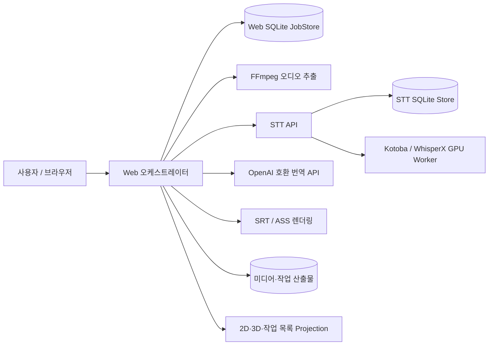
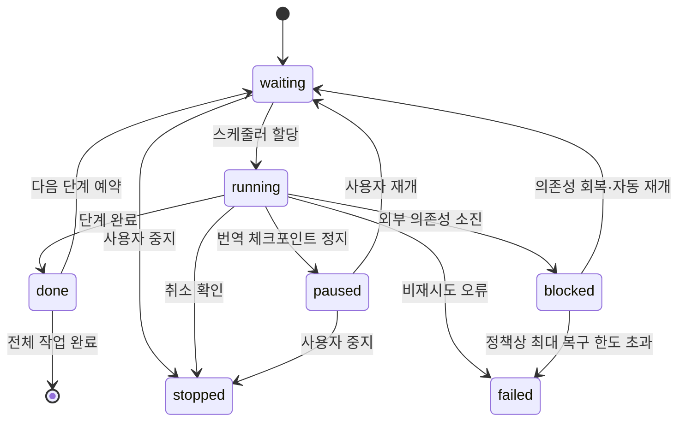
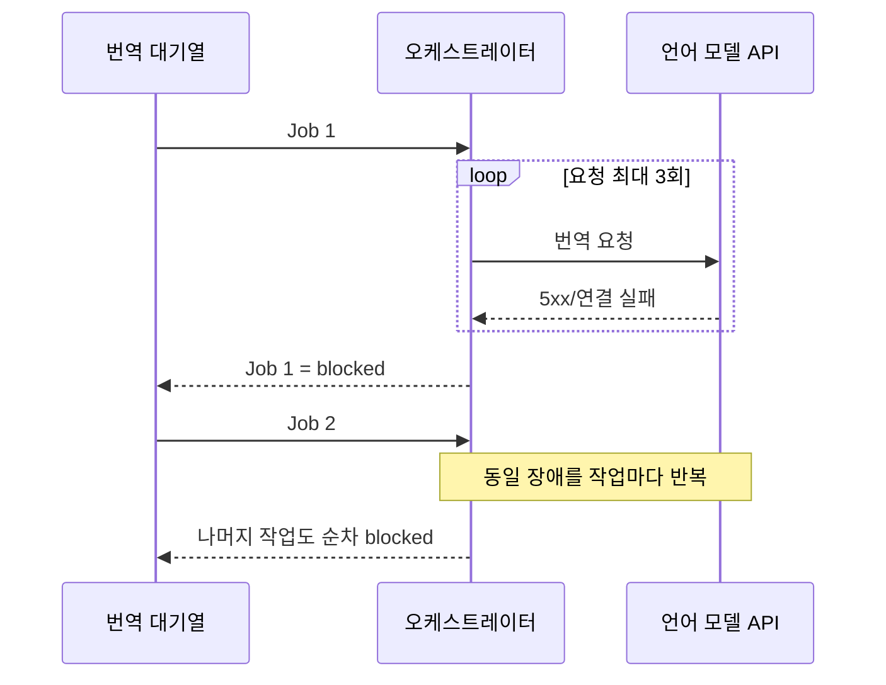

# STT-to-Subtitle 백엔드 리팩터링 분석 보고서

- 작성일: 2026-08-26
- 분석 범위: 웹 오케스트레이터, STT API, 작업 저장소, 외부 서비스 연동, 산출물 처리, 2D/3D 대시보드용 상태 집계
- 기준 버전: 현재 작업 트리의 `4.0.0`

## 1. 결론 요약

현재 코드는 오디오 추출, 원격 전사, 번역, 자막 렌더링이라는 파이프라인 경계를 대체로 지키고 있으며, 번역 체크포인트·전사 요청 멱등성·원자적 JSON 저장·SSE 진행률 수집 등 운영에 필요한 기반도 갖추고 있다.

그러나 작업이 많거나 외부 서비스가 내려간 상황에서 안정적으로 운영하려면 다음 문제를 우선 해결해야 한다.

1. `작업 상태`, `파이프라인 단계`, `외부 서비스 상태`, `사용자 명령`이 하나의 `status`와 자유 형식 오류 문자열에 섞여 있다.
2. 언어 모델 장애가 발생하면 요청 단위 3회 재시도 후 다음 대기 작업을 계속 실행하므로, 대기열 전체가 차례로 `blocked`가 될 수 있다.
3. 웹 프로세스 재시작 시 실행 중이던 모든 작업을 일괄 `blocked`로 바꾸며, 단계별 자동 복구나 원격 STT 작업 재연결이 없다.
4. 사용자 정지를 독립 상태가 아니라 `blocked + 특정 한국어 오류 문구`로 저장한다. UI와 필터가 문구 일치에 의존한다.
5. 2D 대시보드, 3D 대시보드, 작업 목록이 동일한 원천 상태를 각자 다시 분류해 상태 수와 필터 의미가 달라질 수 있다.
6. 전사 중지 요청은 웹의 대기 루프만 중지하고 원격 STT 작업을 취소하지 않아 GPU 작업이 계속될 수 있다.

가장 먼저 해야 할 일은 UI 확장이 아니라 상태 모델과 스케줄러 제어의 정리다. `phase`, `state`, `reason_code`, `attempt`, `next_retry_at`을 분리하고, 외부 서비스별 회로 차단기와 단계별 복구 정책을 추가해야 한다.

## 2. 현재 구조



주요 책임은 다음 파일에 집중되어 있다.

| 영역 | 주요 구현 | 평가 |
|---|---|---|
| 웹 요청·화면·집계 | [`web_app.py`](../src/stt_to_subtitle/web_app.py) | 4천 줄 이상의 모놀리스로 라우트와 화면별 상태 재분류가 혼재 |
| 파이프라인 실행 | [`orchestrator.py`](../src/stt_to_subtitle/orchestrator.py) | 단계 실행, 스케줄링, 정지, 복구, 이벤트 기록이 한 클래스에 집중 |
| 웹 작업 저장 | [`job_store.py`](../src/stt_to_subtitle/job_store.py) | SQLite 기반 영속화는 적절하나 상태·마이그레이션 계약이 약함 |
| 외부 API | [`service_clients.py`](../src/stt_to_subtitle/service_clients.py) | 요청 재시도와 SSE 재연결을 지원하나 장애 종류 분류와 회로 차단이 없음 |
| STT 서비스 | [`stt_api.py`](../src/stt_to_subtitle/stt_api.py), [`transcription_store.py`](../src/stt_to_subtitle/transcription_store.py) | 전사 요청 멱등성과 독립 큐는 장점. 취소와 재시작 복구 정책이 부족 |
| 산출물 | [`audio.py`](../src/stt_to_subtitle/audio.py), [`subtitle.py`](../src/stt_to_subtitle/subtitle.py), [`files.py`](../src/stt_to_subtitle/files.py) | JSON은 원자 저장. WAV 및 SRT/ASS 묶음의 장애 복구 보장은 보강 필요 |

현재 SQLite와 단일 웹 스케줄러는 현 규모에서 유지할 수 있다. 상태 모델을 정리하기 전에 메시지 브로커나 분산 데이터베이스를 도입하면 복잡도만 늘어난다.

## 3. 핵심 도메인 모델 평가

### 3.1 현재 문제

`PipelineJob.status`는 다음 정보를 동시에 표현한다.

- 파이프라인 위치: `extracting`, `transcription_running`, `translation_running`
- 실행 상태: `queued`, `blocked`, `failed`
- 단계 완료 사실: `audio_ready`, `transcribed`, `translation_completed`
- 사용자 동작 결과: 정지를 `blocked`와 특정 오류 문자열로 우회 표현

그 결과 다음과 같은 문제가 생긴다.

- `blocked`가 외부 서비스 장애인지, 프로세스 재시작인지, 사용자 정지인지 구조적으로 구분되지 않는다.
- 대시보드가 오류 문구를 비교해 `stopped`를 추론한다.
- 단계별 필터와 상태별 필터가 직교하지 않는다.
- 새 상태를 추가할 때 저장소, 오케스트레이터, 목록, 2D, 3D를 각각 수정해야 한다.
- 잘못된 상태 전이를 DB 수준이나 도메인 수준에서 차단하지 못한다.

### 3.2 권장 모델

작업의 진입점과 단계를 분리한다.

```text
operation: extract | transcribe | translate | full_pipeline
phase:     extraction | transcription | translation | render | complete
state:     waiting | running | paused | blocked | stopped | failed | done
reason:    lm_unavailable | stt_unavailable | auth_required |
           invalid_input | service_restarted | user_stop |
           artifact_missing | internal_error | ...
```

- `operation`: 사용자가 요청한 작업 범위다. 추출 요청에는 번역 단계가 존재하지 않는다.
- `phase`: 현재 실행하거나 재개할 단계다. `complete`는 전체 작업의 종점이다.
- `state`: 현재 처리 상태다. `stopped`는 사용자 종료, `blocked`는 해소 가능한 외부 조건, `failed`는 자동 재개가 부적절한 실패다.
- `reason_code`: 기계가 판단하는 고정 코드다. 사용자용 메시지와 분리한다.
- `paused`: 체크포인트에서 안전하게 멈추고 이어갈 수 있는 번역에만 사용한다.

`attention`은 도메인 상태로 추가하지 않는다. 화면에서 `paused + blocked + failed` 같은 주의 항목을 묶어 보여주는 표현용 집계일 뿐이다.

### 3.3 상태 전이 원칙



상태 전이는 한 곳의 도메인 서비스에서 검증하고, 저장소는 조건부 갱신으로 동시 실행을 방지해야 한다. 자유 형식 문자열을 기준으로 전이를 결정해서는 안 된다.

## 4. 기능별 추가 개발 평가

| 기능 | 현재 구현 | 추가로 필요한 기능 | 우선순위 |
|---|---|---|---|
| 작업 상태 | 단일 `status`, `blocked_stage`, 자유 형식 `error` | `operation/phase/state/reason_code` 분리, 전이 검증, 기존 데이터 마이그레이션 | P0 |
| 사용자 중지 | `blocked`와 고정 오류 문구로 표현 | 명시적 `stopped`, 요청 시각·확인 시각·요청자 기록 | P0 |
| 번역 일시정지 | 논리 배치 체크포인트 후 정지 | 체크포인트 호환성 지문, 일시정지 작업의 중지 지원 | P0–P1 |
| 요청 재시도 | HTTP 요청마다 기본 3회 | 작업 단위 시도 이력, 영속 백오프, 오류 유형별 정책 | P0 |
| 외부 서비스 장애 | 작업별로 재시도 후 `blocked` | STT/LM별 회로 차단기, 대기열 dispatch gate, half-open probe | P0 |
| 재시작 복구 | 웹 실행 중 상태를 일괄 `blocked` | 단계별 복구·원격 상태 재조회·산출물 검증·자동 재개 | P0 |
| 원격 STT 제어 | 제출·조회·SSE 진행률 | 원격 취소 API, 취소 멱등성, 취소 완료 확인 | P0 |
| 번역 체크포인트 | 번역 ID 단위 부분 저장 | 모델·프롬프트·언어·원문·배치 설정 지문 검증 | P1 |
| 스케줄링 | 생성 시각 FIFO, 단계별 제한 | 의존성별 admission control, 우선순위·공정성, starvation 방지 | P1 |
| 종료 처리 | 짧은 join 후 executor 취소 | graceful drain, lease 만료, 종료 체크포인트, 재시작 소유권 회수 | P1 |
| 오디오 산출물 | FFmpeg가 목적 파일에 직접 기록 | 임시 파일 생성 후 검증·원자 교체, 잔여 파일 정리 | P1 |
| 자막 산출물 | SRT/ASS 각각 임시 저장 | 한 generation manifest로 두 파일의 일관성 검증·복구 | P1 |
| 화면 집계 | 화면별 상태 재분류 | 공통 projection DTO, 동일한 phase/state 필터 계약 | P0 |
| 이벤트·관측성 | 자유 형식 이벤트와 기본 진행률 | 이벤트 코드, attempt/correlation ID, 단계 시간·대기 시간·회로 상태 메트릭 | P1 |
| DB 스키마 | 코드 내부 수동 컬럼 추가 | 버전 마이그레이션, 제약 조건, 인덱스, 외래키 활성화 | P1 |
| 보안 설정 | 원격 API 토큰을 SQLite에 평문 저장 | 토큰 참조/마운트 secret, 현재 토큰 기준 로그 마스킹, 설정 변경 감사 | P0–P2 |
| 미디어 라이브러리 | 파일시스템 중심 조회·집계 | 증분 카탈로그, 변경 감지, 배우 없는 콘텐츠 분류 | P2 |
| 테스트 | 단위 테스트 중심, 주요 정상·부분 실패 검증 | 장애 연쇄·복구·취소 경합·projection 일관성·fault injection 테스트 | P0–P1 |

## 5. 스케줄러·재시도·외부 서비스 장애

### 5.1 현재 언어 모델 장애 시 동작

번역은 한 번에 한 파일을 실행한다. 각 HTTP 요청은 일시적 오류에 대해 최대 3회 재시도하지만, 모두 실패하면 현재 작업을 `blocked`로 저장한다. 스케줄러는 다음 주기에 다음 `transcribed` 작업을 선택하므로 언어 모델이 계속 내려가 있으면 대기 작업도 차례대로 실행되어 모두 `blocked`가 된다.



이는 “대기 중인 작업은 그대로 대기한다”는 운영 기대와 맞지 않는다. 요청 재시도와 서비스 장애 제어는 별도 계층이어야 한다.

### 5.2 권장 회로 차단기

외부 의존성의 `endpoint + model` 조합별로 회로 상태를 관리한다.

1. 현재 작업의 요청 단위 재시도 3회가 소진되면 해당 작업을 `blocked(reason=lm_unavailable)`로 저장한다.
2. 번역 회로를 `open`으로 전환하고 새 번역 작업 할당을 중지한다.
3. 나머지 작업은 `waiting`을 유지한다.
4. `next_probe_at`에 한 건만 시험하는 `half_open` 상태로 전환한다.
5. 성공하면 차단된 작업부터 체크포인트로 재개한 뒤 대기열을 처리한다.
6. 실패하면 지수 백오프와 jitter를 적용해 다시 `open`으로 전환한다.

인증 실패, 모델명 오류, 잘못된 URL처럼 설정 변경 없이는 해결되지 않는 오류는 자동 probe 대상과 구분해 `blocked(reason=auth_required/configuration_invalid)`로 유지해야 한다. 설정 변경 이벤트가 발생하면 즉시 재검증할 수 있다.

회로 상태와 `next_probe_at`은 프로세스 재시작 후에도 유지되도록 DB에 저장한다. 메모리 전용 회로 차단기는 재시작 직후 장애 요청 폭주를 다시 발생시킨다.

## 6. 재시작·장애 복구 전략

현재 웹 오케스트레이터는 시작할 때 실행 중 상태를 모두 `blocked`로 바꾸고 수동 재시도를 요구한다. STT 서비스는 실행 중 작업을 `failed`로 바꾼다. 같은 파이프라인 안에서 복구 의미가 일치하지 않는다.

권장 복구 행렬은 다음과 같다.

| 단계 | 체크포인트 | 재시작 시 처리 | 사용자 표시 |
|---|---|---|---|
| 대기 | DB 행 | 그대로 유지 | 대기 |
| 오디오 추출 | 없음 | 임시 WAV 제거 후 단계 처음부터 자동 재실행 | 대기 → 진행 |
| 전사 | 원격 `stt_job_id`, 원본 WAV | 원격 상태 조회 후 완료 결과 회수 또는 실행 재연결. 원격 작업 유실 시 동일 멱등 키로 재제출 | 진행 또는 외부 서비스 중단 |
| 번역 | 번역 ID별 부분 결과 | 설정 지문 검증 후 미완료 논리 배치부터 재개 | 진행 또는 일시정지 |
| 렌더 | transcript/translation과 generation manifest | 파일 세트 검증 후 DB만 확정하거나 전체 재렌더 | 진행 → 완료 |
| 사용자 중지 | 명시적 `stopped` | 자동 재개하지 않음 | 중지 |
| 비재시도 실패 | `failed + reason_code` | 자동 재개하지 않음 | 실패 |

전사에는 번역처럼 세그먼트 체크포인트를 억지로 도입할 필요가 없다. 모델이 중간 재개를 보장하지 않으므로 원격 작업 ID 재연결과 입력 WAV 기준 재실행이 더 안전하다. 알려진 모델 타임스탬프 보정은 기존 원칙대로 transcript normalization 경계에서 수행해야 한다.

웹 작업이 원격 STT를 기다리다 재시작한 경우에는 다음 순서로 reconcile한다.

1. 저장된 `stt_job_id`로 원격 상태를 조회한다.
2. `completed`이면 결과를 회수하고 다음 단계로 이동한다.
3. `queued/running`이면 SSE 또는 polling을 재연결한다.
4. `failed/cancelled/not_found`이면 원인에 따라 재제출 또는 명시적 실패 처리한다.
5. STT 서비스 자체가 불가하면 STT 회로를 열고 다른 전사 대기 작업은 실행하지 않는다.

## 7. 일시정지·중지·중단·실패의 계약

용어는 다음과 같이 고정하는 것이 적절하다.

| 표시 용어 | 저장 state | 의미 | 자동 재개 |
|---|---|---|---|
| 대기 | `waiting` | 실행 자원 또는 선행 단계 대기 | 예 |
| 진행 | `running` | 현재 worker가 실행 중 | 해당 없음 |
| 일시정지 | `paused` | 사용자가 체크포인트에서 잠시 멈춤 | 사용자 재개 |
| 중지 | `stopped` | 사용자가 작업 종료를 확정 | 아니요 |
| 중단 | `blocked` | 외부 의존성·운영 조건 때문에 진행 불가 | 원인 해소 시 가능 |
| 실패 | `failed` | 입력·내부 처리 등 자동 재개가 부적절한 오류 | 원인 수정 후 수동 재시도 |
| 완료 | `done` | 요청한 operation의 종점 도달 | 해당 없음 |

타임아웃은 그 자체로 `paused`가 아니다. 짧은 네트워크 타임아웃은 내부 재시도 대상이고, 재시도 소진 후 외부 서비스 장애로 판단되면 `blocked`다. 사용자가 작업을 종료한 경우만 `stopped`다.

버튼도 상태 수와 일대일로 만들 필요가 없다.

- 실행 중: `일시정지`는 안전한 체크포인트가 있는 번역에서만 노출, `중지`는 모든 취소 가능한 단계에 노출
- 일시정지: `재개`, `중지`
- 중단: 자동 복구 중이면 버튼 없이 다음 확인 시각 표시, 설정 수정이 필요하면 `설정 확인`, 필요 시 `재시도`
- 실패: `재시도` 또는 `삭제`

## 8. 원격 STT 취소

현재 웹에서 전사를 중지하면 로컬 진행 대기만 종료되고 원격 GPU 작업은 계속될 수 있다. 다음 API 계약이 필요하다.

```http
POST /v1/transcriptions/{job_id}/cancel
```

요구 사항:

- 이미 취소·완료된 요청에도 안전한 멱등 응답
- `cancel_requested`와 최종 `cancelled` 구분
- 실행 전이면 큐에서 제거, 실행 중이면 backend가 제공하는 안전한 취소 지점에서 종료
- 웹은 취소 확인 전까지 `stopping` 같은 별도 사용자 상태를 늘리기보다 `running`에 `stop_requested_at`을 부가 정보로 유지
- 프로세스 재시작 시 취소 요청도 reconcile
- GPU 프로세스를 강제 종료해야만 취소할 수 있는 backend라면 다른 작업 영향과 worker 재기동 정책을 명시

## 9. 체크포인트와 산출물 일관성

### 9.1 번역 체크포인트

현재 번역 ID를 기준으로 완료 결과를 재사용하는 방식은 적절하다. 다만 다음 값의 지문을 체크포인트에 함께 저장해야 한다.

- 원문 transcript 내용 또는 canonical hash
- source/target language
- 번역 endpoint와 model 식별자
- system/user prompt 템플릿 버전
- logical batch 구성 및 정규화 규칙 버전
- 계약 schema 버전

지문이 달라졌다면 기존 결과를 조용히 혼합하지 말고 새 generation으로 시작하거나 명시적 호환 마이그레이션을 수행한다. 토큰·자격 증명은 지문이나 산출물 metadata에 포함하지 않는다.

### 9.2 오디오·자막 파일

- WAV는 동일 디렉터리의 임시 파일에 생성하고 FFprobe 등으로 최소 유효성을 확인한 뒤 원자 교체한다.
- SRT와 ASS는 각각 원자 교체하는 것만으로 두 파일의 동일 generation을 보장할 수 없다.
- 두 파일의 hash, 입력 transcript/translation hash, renderer version을 담은 작은 manifest를 마지막에 원자 저장한다.
- 재시작 시 manifest가 없거나 hash가 맞지 않으면 전체 렌더 단계를 다시 실행한다.

파일 생성과 DB 상태 갱신은 하나의 ACID 트랜잭션이 될 수 없으므로, “파일을 먼저 안전하게 완성 → manifest 확정 → DB 완료 처리” 순서와 재시작 reconcile로 일관성을 보장한다.

## 10. 2D·3D 대시보드와 작업 목록 Projection

백엔드는 화면별 문구나 배치에 맞춘 상태 재분류 대신 공통 projection을 제공해야 한다.

```json
{
  "phase_counts": {
    "extraction": {"waiting": 3, "running": 1, "done": 18},
    "transcription": {"waiting": 4, "blocked": 1, "done": 12},
    "translation": {"running": 1, "paused": 1, "failed": 1, "done": 9}
  },
  "job_counts": {
    "waiting": 7,
    "running": 2,
    "paused": 1,
    "blocked": 1,
    "stopped": 66,
    "failed": 1,
    "done": 247
  }
}
```

핵심 규칙은 다음과 같다.

- 단계 통계와 전체 작업 통계를 구분한다. `추출 완료 3`은 작업 완료가 아니라 추출 단계 완료이므로 단계 문맥 안에서만 표시한다.
- `완료`는 사용자가 요청한 operation의 종점에 도달한 전체 작업 수다.
- 선택하지 않은 번역 단계는 추출 전용 작업에 노출하지 않는다.
- 목록 필터는 `operation`, `phase`, `state`, `reason_code`를 독립 query parameter로 처리한다.
- 2D, 3D, 작업 목록은 같은 projection service와 filter parser를 사용한다.
- 3D는 수백 건을 개별 객체로 만들지 않는다. 진행 작업은 개별 표시할 수 있으나 대기·중단·중지·실패·완료는 count와 제한된 sample을 가진 구역·랙·슬롯으로 집계한다.
- legend는 가능한 모든 조합을 나열하지 않고 현재 결과에 존재하는 상태와 수만 표시한다.

권장 응답 DTO:

```text
DashboardProjection
├── job_counts[state]
├── phase_counts[phase][state]
├── active_jobs[]
├── state_bays[state]
│   ├── count
│   ├── sample_jobs[]
│   └── filter_url
└── dependency_health[stt|lm]
```

`중지 66건`, `외 63건`, `대기 큐 3건`이라면 중지 구역에 3건을 미리보기로 보여주고 나머지 중지 63건이 있다는 뜻이어야 한다. 대기 큐 3건과는 별개다. 이 의미를 DTO에서 `count=66`, `sample_jobs.length=3`으로 명시해 템플릿의 임의 계산을 제거한다.

## 11. 저장소와 마이그레이션

권장 스키마의 핵심 필드는 다음과 같다.

```sql
jobs(
  id,
  operation,
  current_phase,
  state,
  reason_code,
  reason_detail,
  attempt,
  max_attempts,
  next_retry_at,
  lease_owner,
  lease_expires_at,
  stop_requested_at,
  paused_at,
  created_at,
  updated_at
)
```

추가 권장 사항:

- `CHECK` 제약 또는 repository enum 검증으로 허용 값을 고정한다.
- SQLite 연결마다 `PRAGMA foreign_keys=ON`을 적용한다.
- `(state, current_phase, next_retry_at, created_at)` 인덱스를 추가한다.
- 문자열 컬럼 존재 여부를 확인하는 즉석 변경 대신 순차적이고 반복 실행 가능한 schema migration을 사용한다.
- job event에는 `event_code`, `from_state`, `to_state`, `phase`, `attempt`, `correlation_id`, `payload_json`을 둔다.
- 기존 `blocked + 사용자 중지 오류 문구` 데이터는 배포 마이그레이션에서 `stopped + user_stop`으로 변환한다.
- 알 수 없는 레거시 오류는 억지 분류하지 않고 `blocked + legacy_unclassified`로 보존해 운영자가 검토할 수 있게 한다.

단일 웹 인스턴스에서는 SQLite를 유지할 수 있다. 다중 웹 스케줄러를 실제로 운영해야 할 때 lease 경쟁, 알림 지연, 쓰기 경합을 측정한 뒤 PostgreSQL이나 브로커 전환을 판단한다.

## 12. 관측성과 운영 기능

추가해야 할 최소 운영 지표:

- 단계별 대기 시간과 처리 시간
- 상태별 작업 수 및 가장 오래된 대기 작업 나이
- 외부 API 요청·재시도·소진 횟수
- STT/LM 회로 상태, 마지막 성공 시각, 다음 probe 시각
- 작업별 attempt 수와 reason code 분포
- lease 만료·복구·중복 실행 방지 횟수
- 원격 STT 큐 길이, 실행 작업 ID, 취소 대기 수
- 번역 체크포인트 재사용·무효화 횟수
- 산출물 manifest 검증 실패 수

로그는 사용자용 메시지와 별개로 구조화한다. 토큰 마스킹은 초기 환경설정 값뿐 아니라 관리 화면에서 변경된 현재 런타임 토큰 전체에 적용해야 한다. 원격 서버 URL, job ID, attempt ID는 추적에 필요하지만 인증 헤더·토큰·원문 전체는 기록하지 않는다.

## 13. 보안·설정 관리

현재 컨테이너의 read-only 실행, 권한 제한, 런타임 환경 변수 사용은 유지할 가치가 있다. 추가 개선은 다음 순서가 적절하다.

1. 오류 정제 함수가 현재 활성 토큰을 항상 마스킹하도록 수정한다.
2. 원격 설정 변경 이력을 actor·시각·변경 필드 단위로 기록한다. 토큰 값 자체는 기록하지 않는다.
3. SQLite에 원격 토큰을 직접 저장하는 대신 환경 변수명, Docker secret 경로, 외부 secret reference를 저장한다.
4. 내부망 URL 접근이 가능한 관리 기능은 관리자 인증·허용 대상 정책과 함께 운영한다.
5. 산출물 metadata와 체크포인트에 provider credential이 포함되지 않는지 계약 테스트를 추가한다.

저장 토큰 암호화는 키를 같은 DB나 같은 설정 파일에 두면 효과가 제한적이다. 운영 환경의 키 관리 방식이 정해진 뒤 적용해야 한다.

## 14. 미디어 라이브러리

파일시스템을 직접 스캔하는 현재 방식은 중간 규모까지 단순하고 신뢰할 수 있다. 배우 약 400명과 미디어 증가를 고려하면 다음 기능은 P2로 준비할 수 있다.

- 파일 경로, 크기, 수정 시각, content ID, 배우, 썸네일을 저장하는 증분 카탈로그
- `.actors` 프로필 이미지와 배우 디렉터리의 명시적 매핑
- 배우가 없는 버라이어티 콘텐츠를 `uncast/variety` 같은 별도 분류로 집계
- 경로 단축 규칙은 원본 경로를 변경하지 않는 표시 projection으로만 적용
- 삭제·이동 감지와 고아 transcript/subtitle 정리 후보 보고
- 전체 배우를 한 번에 렌더링하지 않는 검색·페이지네이션·상위 활동 항목 집계

라이브러리 진척은 임의의 5개 항목이 아니라 전체 라이브러리의 단계별 집계와 사용자가 선택한 필터 결과를 기준으로 해야 한다. 대표 항목을 보여줄 때는 `최근 작업`, `미완료 우선`, `배우별` 중 어떤 규칙인지 DTO에 명시한다.

## 15. 권장 모듈 분리

대규모 재작성보다 기존 구현에서 책임을 순차적으로 꺼내는 방식이 안전하다.

```text
src/stt_to_subtitle/
├── domain/
│   ├── job_state.py          # enum, 전이 규칙, reason code
│   └── job_policy.py         # 재시도·복구 판단
├── application/
│   ├── job_service.py        # 사용자 명령
│   ├── scheduler.py          # 할당·공정성·dispatch gate
│   └── recovery.py           # 재시작 reconcile
├── infrastructure/
│   ├── job_repository.py     # SQLite 영속화
│   ├── migrations/           # 버전별 스키마 변경
│   └── artifact_store.py     # generation·manifest
├── integrations/
│   ├── stt_client.py
│   ├── lm_client.py
│   └── circuit_breaker.py
├── projections/
│   └── job_projection.py     # 목록·2D·3D 공통 집계
└── web/
    └── routes/
        ├── dashboard.py
        ├── jobs.py
        ├── media.py
        └── settings.py
```

기존 [`audio.py`](../src/stt_to_subtitle/audio.py), transcript normalization, translation contract, subtitle renderer의 경계는 유지한다. 모듈을 나누기 전에 현재 동작을 characterization test로 고정해야 한다.

## 16. 단계별 실행 계획

### 1단계 — 상태 계약 고정(P0)

- 도메인 enum과 전이 표 작성
- `operation/phase/state/reason_code` 컬럼 추가
- 레거시 상태 변환 및 rollback 가능한 migration 작성
- 정지 오류 문구 판별 제거
- 공통 projection과 phase/state 필터 도입

완료 기준: 같은 fixture에서 작업 목록·2D·3D의 상태 수와 filter URL 결과가 동일하다.

### 2단계 — 장애 전파 차단(P0)

- 오류를 transient/auth/config/input/internal로 분류
- STT·LM별 영속 회로 차단기 추가
- `attempt/next_retry_at` 기반 자동 재개
- 10건 이상 대기열에서 의존성 장애가 나도 현재 작업만 중단되고 나머지는 대기로 남도록 보장

완료 기준: LM이 내려간 동안 10개 작업 중 한 작업만 외부 서비스 중단으로 전환되고 나머지 9개는 대기한다. LM 복구 후 중단 작업부터 자동 재개된다.

### 3단계 — 복구·취소(P0–P1)

- 단계별 startup reconcile
- 원격 STT 취소 API와 웹 연동
- graceful shutdown과 worker lease
- 번역 체크포인트 지문

완료 기준: 각 단계에서 프로세스를 강제 종료해도 중복 산출물·유실 없이 정의된 지점에서 자동 복구한다.

### 4단계 — 산출물·관측성(P1)

- WAV staged write
- SRT/ASS generation manifest
- 구조화 이벤트와 운영 메트릭
- DB 제약·인덱스·외래키 정비

완료 기준: 파일 교체와 DB 갱신 사이에 fault를 주입해도 재시작 reconcile 후 파일 세트와 DB 상태가 일치한다.

### 5단계 — 확장 기능(P2)

- 증분 미디어 카탈로그
- 대기열 우선순위·공정성 정책
- 운영 요구가 확인된 경우에만 다중 스케줄러와 외부 브로커 검토

## 17. 필수 테스트 시나리오

1. LM 장애 상태에서 번역 10건을 넣었을 때 첫 작업만 `blocked`, 나머지는 `waiting`인지 확인
2. LM 복구 후 체크포인트부터 자동 재개되고 대기열 순서가 보존되는지 확인
3. 인증 오류는 반복 probe하지 않고 설정 변경 후에만 재검증하는지 확인
4. 전사 실행 중 웹만 재시작해 원격 작업에 재연결하는지 확인
5. STT 서비스 재시작으로 원격 작업이 유실될 때 동일 멱등 키로 안전하게 재처리하는지 확인
6. 실행 중·대기 중·일시정지 작업을 각각 중지했을 때 모두 `stopped`로 일관되게 끝나는지 확인
7. 전사 중지 시 원격 GPU 작업도 실제 취소되는지 확인
8. pause와 batch 완료가 동시에 발생해도 번역 ID가 중복·유실되지 않는지 확인
9. 체크포인트의 model/prompt/source hash가 바뀌면 기존 부분 번역을 재사용하지 않는지 확인
10. WAV 생성, SRT 교체, ASS 교체, manifest 기록, DB 완료 갱신 각 지점의 강제 종료 복구 확인
11. 동일 데이터에 대해 목록·2D·3D의 상태 수, sample 수, filter 결과가 일치하는지 확인
12. 레거시 사용자 정지 데이터가 `stopped/user_stop`으로 정확히 마이그레이션되는지 확인
13. 변경된 런타임 토큰이 예외·이벤트·로그에서 마스킹되는지 확인
14. 잘못된 상태 전이와 중복 worker claim이 거부되는지 확인

## 18. 피해야 할 변경

- 번역 일시정지와 UI 대칭성을 맞추기 위해 전사 모델에 임의의 세그먼트 체크포인트를 추가하지 않는다.
- `attention`을 저장 상태나 상위 phase로 만들지 않는다.
- 사용자 정지를 지역화된 오류 문구로 판별하지 않는다.
- 화면마다 상태를 별도로 재분류하지 않는다.
- 외부 서비스 장애 중 대기 작업을 하나씩 실행해 동일 실패를 반복하지 않는다.
- 현재 단일 인스턴스 요구만으로 PostgreSQL·Redis·메시지 브로커 전환부터 시작하지 않는다.
- 기존 transcript/translation ID와 자막 overlap 규칙을 상태 리팩터링 과정에서 변경하지 않는다.

## 19. 최종 권고

이 프로젝트의 다음 리팩터링 단위는 “화면별 상태 라벨 수정”이 아니라 “작업 실행 계약의 재정의”여야 한다. 먼저 명시적 상태 모델과 공통 projection을 도입하고, 외부 서비스 장애를 작업 큐 전체로 전파하지 않는 회로 차단기, 단계별 재시작 복구, 원격 STT 취소를 구현해야 한다.

이 네 가지가 갖춰지면 2D와 3D는 동일한 수치와 용어를 안정적으로 표현할 수 있고, 대기 작업이 많은 운영 환경에서도 재시작·모델 교체·외부 서비스 장애를 수동 정리 없이 처리할 수 있다.
