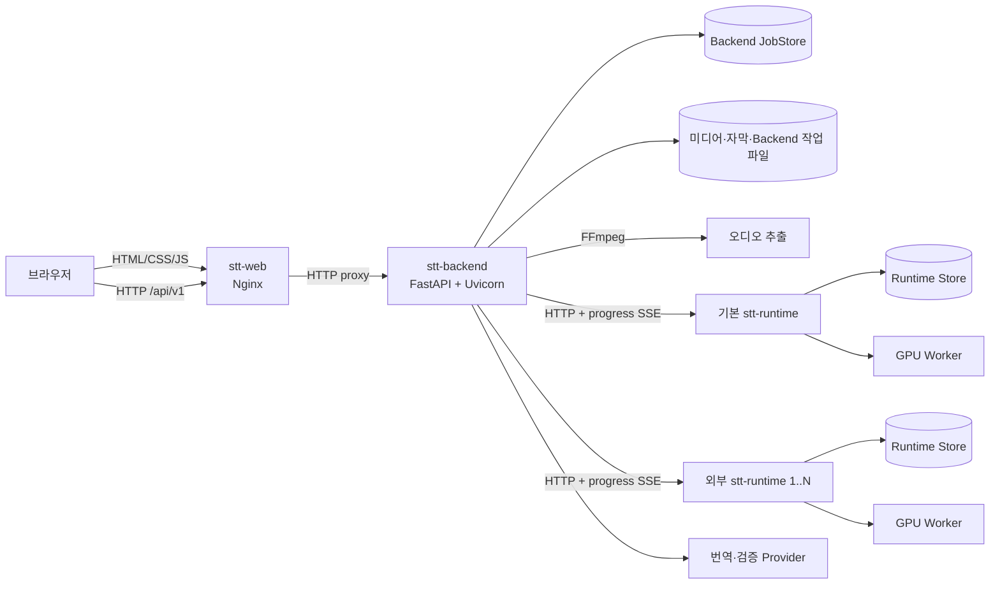

# STT 서비스 분리 계획

## 1. 결정 사항

목표 구성은 다음 세 개의 독립 실행 컨테이너로 고정한다.

| 서비스 | 실행 스택 | 책임 | 금지 사항 |
| --- | --- | --- | --- |
| `stt-web` | Nginx | 정적 HTML·CSS·JavaScript 제공, `/api` 프록시 | Python, Jinja2, SQLite, FFmpeg, GPU, 비밀 값, 영속 볼륨 |
| `stt-backend` | FastAPI + Uvicorn | 작업 API, 스케줄링, 미디어 탐색, 오디오 추출, 번역, 자막 렌더링, 상태·설정 원장 | Jinja2 화면 렌더링, ML 모델 로딩, CUDA 의존성 |
| `stt-runtime` | FastAPI + Uvicorn | 전사 요청 큐, GPU worker, 모델 수명주기, 전사 진행·취소·결과 API | 사용자 화면, 미디어 라이브러리 탐색, 번역, 자막 렌더링, Web JobStore 소유 |

백엔드 구현은 현재 프로젝트와 테스트 자산을 재사용할 수 있는 FastAPI +
Uvicorn으로 유지한다. Flask + Gunicorn으로 변경할 운영상 이점이 없으므로
선택하지 않는다.

## 2. 분리 전 구조의 문제

분리 전에는 실행 역할과 이름이 일치하지 않았다.

- `stt-web`은 FastAPI + Jinja2 화면 서버이면서 오케스트레이터, JobStore,
  FFmpeg 추출, 번역 호출, 자막 렌더링까지 수행한다.
- `stt-backend`라는 컨테이너는 당시 전사 Runtime API를 실행하며 실제 역할은
  GPU 전사 런타임이다.
- Compose의 `stt-runtime`은 실행 서비스가 아니라 ML 기반 이미지를 만드는
  `build` 프로필이다.
- 현재 브라우저 화면은 서버가 렌더링한 Jinja2 HTML과 HTML fragment에
  의존한다. Nginx 이미지로 단순 교체하면 대시보드, 미디어 탐색, 작업 목록,
  설정 화면이 모두 동작하지 않는다.

컨테이너 이름만 교체하지 않고 브라우저 API 계약을 구성한 뒤 Jinja2를
제거했다.

## 3. 목표 데이터 흐름

요청 경로는 다음과 같이 고정한다.

| 외부 경로 | 소유 서비스 | 비고 |
| --- | --- | --- |
| `/`, `/media`, `/jobs`, `/settings` | `stt-web` | 정적 HTML 진입점. 클라이언트 라우팅 전까지 각 경로에 실제 HTML 파일 제공 |
| `/assets/*` | `stt-web` | fingerprint가 포함된 정적 자산, 장기 캐시 허용 |
| `/api/v1/*` | `stt-backend` | Nginx 동명 경로 프록시 |
| `/v1/transcriptions/*` | `stt-runtime` | Compose 내부망 전용, 외부 라우터에 노출하지 않음 |
| `/healthz` | 각 서비스 | 프로세스 생존과 로컬 의존성만 확인 |
| `/readyz` | `stt-backend`, `stt-runtime` | 요청 수락 가능 여부. GPU 모델 로드 여부와 분리 |

## 4. 저장소와 볼륨 경계

| 자원 | `stt-web` | `stt-backend` | `stt-runtime` |
| --- | --- | --- | --- |
| 정적 자산 | 이미지에 읽기 전용 포함 | 없음 | 없음 |
| 미디어 루트 | 마운트 금지 | 읽기·쓰기 | 마운트 금지 |
| Backend SQLite | 마운트 금지 | 단독 소유 | 마운트 금지 |
| Backend 작업 파일 | 마운트 금지 | 단독 소유 | 마운트 금지 |
| Runtime SQLite·수신 WAV | 마운트 금지 | HTTP로만 접근 | 단독 소유 |
| 모델 캐시 | 마운트 금지 | 마운트 금지 | 단독 소유 |
| GPU device | 할당 금지 | 할당 금지 | 단독 할당 |
| Provider token | 주입 금지 | 필요한 token만 런타임 환경으로 주입 | `HF_TOKEN`만 주입 |

Backend와 Runtime은 작업 파일을 공유 볼륨으로 연결하지 않는다. Backend가
추출한 WAV는 현재처럼 Runtime API에 업로드한다. 이 경계는 두 서비스가 서로
다른 호스트로 이동해도 유지된다.

## 5. 이미지 구성

### `Dockerfile.web`

- digest가 고정된 Nginx 이미지를 이미지 기본 비특권 사용자로 실행
- 정적 사이트와 Nginx 설정만 복사
- Python wheel과 `requirements-web.txt` 설치 금지
- root filesystem read-only, `/tmp`와 Nginx runtime 디렉터리만 tmpfs
- Backend 주소는 Compose DNS 이름 `backend`로만 해석

### `Dockerfile.backend`

- Python 3.11 slim 기반
- `requirements-backend.txt`의 Backend 전용 의존성만 설치
- FFmpeg 포함
- 서비스 전용으로 staged된 Python 모듈에서 Uvicorn 실행
- CUDA, Kotoba, WhisperX, WhisperJAV 의존성 포함 금지

### `Dockerfile.runtime`

- 고정 ML 기반 이미지 위에 Runtime 의존 모듈만 추가
- Runtime 전용 Python 모듈에서 전사 API 실행
- GPU device와 모델 캐시는 이 컨테이너에만 연결

고비용 ML 기반 이미지 빌드는 실행 서비스와 이름이 충돌하지 않도록
`Dockerfile.stt-runtime`과 Compose의 `runtime-base` build profile로 분리한다.

## 6. API 전환 계약

정적 화면이 Jinja2 없이 동작하려면 다음 API가 먼저 제공되어야 한다.

1. `GET /api/v1/dashboard`
   - 상태 집계, phase slot, 최근 완료, 대기 큐, GPU snapshot
2. `GET /api/v1/media`
   - 폴더·파일·배우·포스터·외부 자막·처리 상태, 검색과 pagination
3. `POST /api/v1/jobs`
   - 단일·폴더·다중 작업 생성, idempotency key 지원
4. `GET /api/v1/jobs`
   - `phase`, `state`, `reason`, cursor 기반 pagination
5. `GET /api/v1/jobs/{id}`
   - 진행 단계, revision, artifact, 비교·검증 결과
6. 작업 제어 API
   - retry, stop, pause/resume translation, reprocess, delete record
7. 설정 API
   - Runtime 등록·수정·삭제·probe, 번역 provider, prompt revision, 경로 단축 규칙,
     외부 자막 검증 provider
API 응답은 Jinja2 view model을 그대로 노출하지 않는다. `api_version`, 안정된
enum, KST 표기 전 원본 UTC timestamp, pagination metadata를 가진 DTO를
명시적으로 정의한다.

## 7. 실행 순서

### 단계 A — 서비스 경계와 이름 정리

1. 현재 `stt-web` Python 이미지를 `Dockerfile.backend`로 이동한다.
2. 현재 GPU STT 이미지를 `Dockerfile.runtime`으로 이동한다.
3. ML 기반 이미지 파일을 `Dockerfile.runtime-base`로 이름 변경한다.
4. Compose를 `web -> backend -> runtime` 3개 실행 서비스로 변경한다.
5. Nginx를 edge로 추가하고 기존 SSR 경로를 Backend로 프록시한다.

이 단계의 SSR 프록시는 무중단 전환을 위한 임시 호환 계층이다. 이 상태를
`stt-web 정적화 완료`로 간주하지 않는다.

### 단계 B — Backend JSON API 완성

1. API 쓰기 요청의 idempotency key 계약을 추가한다.
2. `/api/v1` route를 별도 router로 구성한다.
3. 기존 HTML route와 JSON API가 같은 application service를 사용하도록 한다.
4. route test, schema snapshot, invalid state 및 pagination test를 추가한다.

### 단계 C — Raw HTML 정적 프런트 전환

1. `web/`에 HTML, CSS, ES module JavaScript를 구성한다.
2. Jinja2의 조건문·반복문을 DOM component 함수로 이동한다.
3. HTML fragment polling을 JSON API 조회로 교체한다.
4. 현재 2D·3D·모바일 기능의 route/static/JavaScript test를 이식한다.
5. Nginx가 모든 사용자 화면과 정적 자산을 직접 제공하도록 전환한다.

### 단계 D — Jinja2 제거와 의존성 축소

1. Backend의 HTML route, template, static mount를 제거한다.
2. `jinja2`, `python-multipart` 중 API에서 불필요한 의존성을 제거한다.
3. Nginx에 `/api/v1` 이외의 Backend proxy 경로가 없는지 검사한다.
4. Backend 이미지에 template/static 파일이 포함되지 않는지 검사한다.

## 8. 배포와 롤백

- 동일 릴리스에서 DB schema 변경과 화면 전환을 함께 수행하지 않는다.
- 단계 A는 기존 Backend JobStore와 Runtime Store를 그대로 마운트한다.
- Nginx 전환 실패 시 Traefik service target만 기존 Backend port로 되돌릴 수
  있어야 한다.
- 단계 C 배포 동안 이전 정적 bundle을 image tag로 보존한다.
- Runtime 롤백은 애플리케이션 image만 되돌리고 모델 캐시와 Runtime Store는
  유지한다.
- `depends_on`은 시작 순서만 보조한다. Backend는 Runtime 장애 시 healthy를
  유지하되 readiness와 작업 상태에서 Runtime unavailable을 구분한다.
- 기본 배포는 세 서비스를 함께 실행하는 All-in-One 구성을 유지한다.
- 외부 GPU 호스트는 `compose.runtime.yaml`로 Runtime만 실행한다. Backend는
  Web UI에 등록된 Runtime 풀의 가용 슬롯으로 새 작업을 분산한다.
- 원격 전사 ID와 Runtime ID를 Backend JobStore에 함께 저장하며, 진행·복구·취소
  요청은 작업을 접수한 Runtime으로만 보낸다.
- 번역 LLM 서버는 Runtime 풀에 포함하지 않으며 Backend의 독립 provider 설정을
  그대로 사용한다.

## 9. 완료 기준

- `stt-web` 이미지에서 `python`, Jinja2, SQLite, FFmpeg가 발견되지 않는다.
- `stt-web`에는 미디어·상태·작업·모델 볼륨과 token 환경 변수가 없다.
- `stt-backend`에서 CUDA 라이브러리와 ML 모델 import가 불가능하다.
- `stt-runtime`만 GPU device와 모델 캐시를 소유한다.
- 외부 Docker network에는 `stt-web`만 연결된다.
- 기본 Runtime은 포트를 게시하지 않는다. 외부 Runtime은 Backend 접근용 포트만
  게시하고 Traefik label은 사용하지 않는다.
- 2D·3D·미디어·작업·설정 기능이 Jinja2 없이 동작한다.
- Nginx access log에 token·query payload가 남지 않는다.
- 기존 JobStore와 Runtime Store를 마이그레이션 없이 재사용하거나, 필요한
  migration과 rollback 절차가 검증되어 있다.

이 완료 기준을 모두 충족하기 전에는 세 서비스 분리가 끝났다고 보고하지
않는다.

## 10. 현재 적용 범위

현재 변경에는 다음 항목을 적용했다.

- Nginx 기반 `stt-web`과 최소 정적 상태 화면
- Jinja2·multipart·GPU worker 코드를 포함하지 않는 `stt-backend` 패키지
- GPU·모델 캐시를 단독 소유하는 `stt-runtime` 실행 컨테이너
- Backend·Jinja2 화면 코드를 포함하지 않는 `stt-runtime` 패키지
- `web <-> backend`, `backend <-> runtime` Docker network 분리
- 작업·미디어·설정·비교·리비전·검증·운영 지표 `/api/v1` API
- Runtime 풀 API, 작업별 Runtime 고정 할당, 외부 Runtime 전용 Compose
- 퇴역한 `web_app.py`, Jinja2 template, Python 웹 정적 자산과 의존성 제거

아직 적용하지 않는 항목은 다음과 같다.

- 기존 Jinja2 2D·3D·미디어·설정 화면의 정적 프런트 이식
- 생성 요청 idempotency key와 cursor pagination

따라서 이번 변경은 실행 서비스와 이미지 코드 경계, Backend API, 최소 화면
제공까지를 범위로 삼는다. 디자인과 전체 프런트 기능은 후속 전용 작업에서
처리한다.
